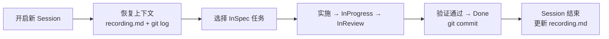

# diwu-workflow 产品层

- **定位**：Claude Code 插件，提供结构化编码工作流
- **目标**：通过任务状态机、Session 规范和防漂移 Hooks，让 Agent 在多 Session 协作中保持一致性和可追溯性
- **版本**：0.8.0
- **创建**：2026-04-10
- **改写**：2026-04-10
- **状态**：当前主版本

---

## 核心用户旅程

### 旅程 A：新项目启动

```mermaid
flowchart LR
    A[用户新建项目] --> B[/dinit\n初始化工作流结构]
    B --> C[CLAUDE.md\ntask.json\nrecording.md\nsettings.json\ninit.sh\nsmoke.sh]
    C --> D[/dtask\n拆解任务列表]
    D --> E[人工确认 InSpec]
    E --> F[Agent 开始实施]
```

### 旅程 B：日常开发 Session



### 旅程 C：架构决策

```mermaid
flowchart LR
    A[发现重大技术选型] --> B[/dadr\n记录决策]
    B --> C[.doc/adr/ADR-NNN.md]
    C --> D[task.json steps 中引用 ADR]
```

### 旅程 D：补全产品文档

```mermaid
flowchart LR
    A[有代码或需求] --> B[/ddoc\n选择正向或逆向模式]
    B --> C[写文档 + 两层完整性检查]
    C --> D[输出到 .doc/ 目录]
```

### 旅程 E：纠偏恢复

```mermaid
flowchart LR
    A[AI 偏离主线] --> B[/dcorr\n五步纠偏协议]
    B --> C[锚定目标/主线/现象/缺口]
    C --> D[回到正确路径继续实施]
```

---

## 命令概览

| 命令 | 用途 |
|------|------|
| `/dinit` | 项目初始化 |
| `/dtask` | 任务规划 |
| `/dprd` | 产品需求文档 |
| `/dadr` | 架构决策记录 |
| `/ddoc` | 产品文档 |
| `/ddemo` | 能力验证 |
| `/dcorr` | 纠偏恢复 |
| `/dcorr` | 纠偏恢复 |

---

## 非功能需求

| 维度 | 要求 |
|------|------|
| **兼容性** | 依赖 Claude Code 插件系统，不依赖特定编程语言或框架 |
| **安装方式** | `/plugin install diwu-workflow@ssdiwu` 一行命令 |
| **配置文件** | settings.json 中的工作流参数，hooks 由插件内置 |
| **存储** | 所有状态文件在项目 `.claude/` 目录内，随 git 管理 |
| **离线可用** | 核心工作流（task.json、recording.md）不依赖网络 |
