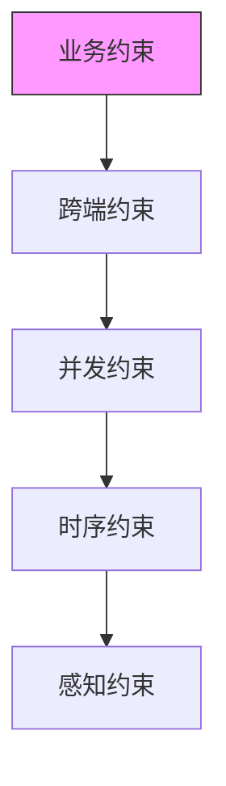

# 五约束维度详解

## 概述

约束 = 不管系统怎么运行，恒成立的东西。五个维度覆盖 toC 产品复杂性的所有来源。

下层是上层的基础。业务约束定义错了，上面四层全是空中楼阁。

## 五约束维度

| 维度 | 检验问题 | 典型例子 |
|------|---------|---------|
| **业务约束** | 100 年后还成立吗？ | "已删除的记录不可恢复" |
| **时序约束** | 有没有执行路径可以绕过？ | "终态不可回退" |
| **跨端约束** | 两端不同是 bug 吗？ | "枚举值在所有端完全一致" |
| **并发约束** | 两个线程同时做会出问题吗？ | "状态机事件串行处理" |
| **感知约束** | 超过阈值用户会注意到吗？ | "操作响应 < 100ms" |

## 业务约束

**定义**：不随技术实现变化的规则，100 年后仍然成立。

**检验问题**：
- 这条规则是业务本质决定的，还是当前实现方式决定的？
- 换一个技术栈，这条规则还成立吗？

**典型例子**：
- "已删除的记录不可恢复"（业务规则）
- "订单金额不可为负"（业务规则）
- "用户 ID 全局唯一"（业务规则）

**常见遗漏**：AI 喜欢写"能做什么"，不写"不能做什么"。负面约束（"X 不可逆"、"Y 不能超过 Z"）往往是最关键的业务规则，也是最容易被遗漏的。

## 时序约束

**定义**：操作的先后顺序、状态转移的合法路径。

**检验问题**：
- 有没有执行路径可以绕过这个状态转移？
- 状态转移表画了吗？

**典型例子**：
- "订单必须先支付才能发货"（时序约束）
- "终态不可回退"（时序约束）
- "状态机非法转移一律忽略"（时序约束）

**实现方式**：状态机 + 转移表

## 跨端约束

**定义**：多端（前端/后端/移动端）必须保持一致的概念。

**检验问题**：
- 两端对这个概念的定义不同，是 bug 吗？
- 枚举值在所有端完全一致吗？

**典型例子**：
- "订单状态枚举在前后端完全一致"（跨端约束）
- "时间戳格式统一为 ISO 8601"（跨端约束）
- "错误码在所有端有唯一定义"（跨端约束）

## 并发约束

**定义**：多个用户/线程同时操作时的策略。

**检验问题**：
- 两个用户同时做这件事会出问题吗？
- 并发策略写了吗？

**典型例子**：
- "状态机事件串行处理"（并发约束）
- "库存扣减使用乐观锁"（并发约束）
- "同一用户的请求串行执行"（并发约束）

## 感知约束

**定义**：用户可感知的性能、延迟、体验阈值。

**检验问题**：
- 超过这个阈值，用户会注意到吗？
- 响应时间、加载策略有具体阈值吗？

**典型例子**：
- "操作响应 < 100ms"（感知约束）
- "页面首屏加载 < 2s"（感知约束）
- "音频源切换 < 100ms"（感知约束）
