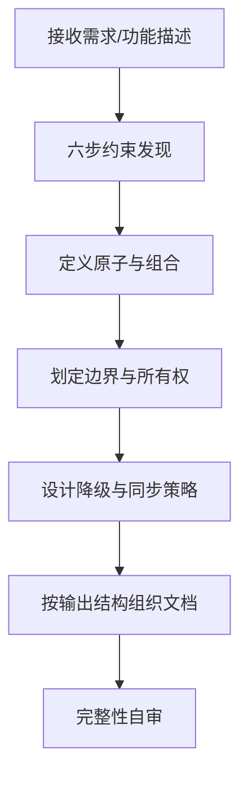
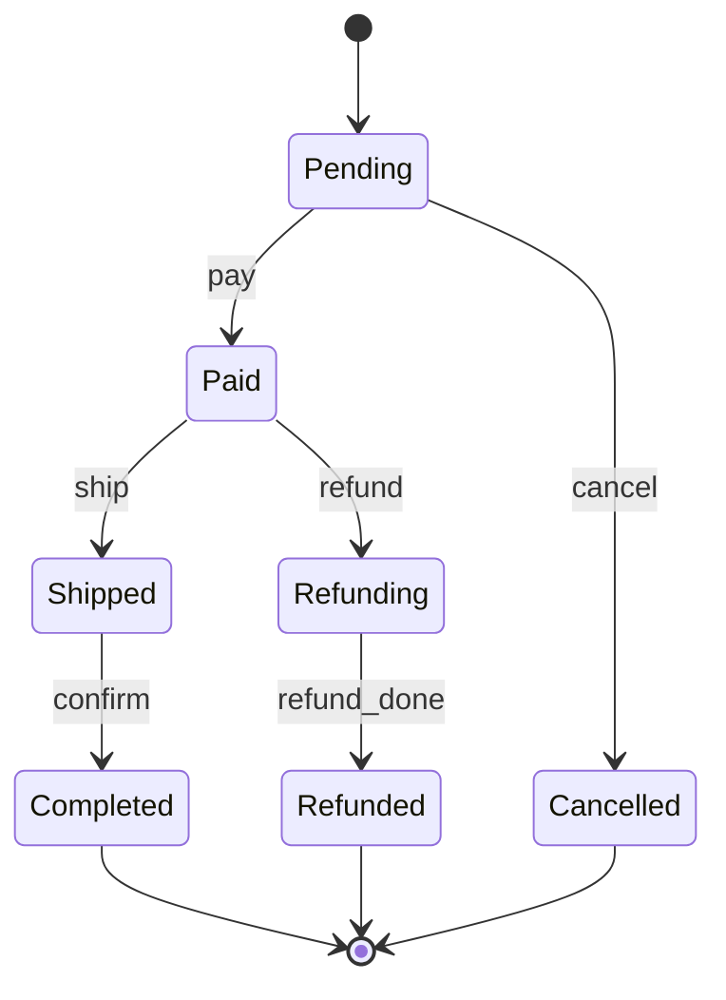
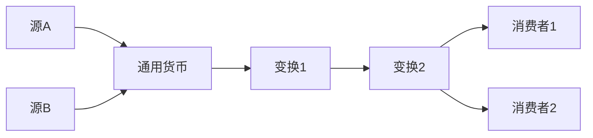

# 正向模式：需求 → 文档

## 工作流



核心工作：用五约束维度从需求中提取约束，再用六步设计法组织成文档。

## 六步设计法

```
Step 1: 找约束
  ├── 100 年后还成立？              → 业务约束
  ├── 能绕过这个状态转移吗？        → 时序约束
  ├── 两端不同是 bug 吗？           → 跨端约束
  ├── 两个线程同时做会出问题吗？    → 并发约束
  └── 超标用户会注意到吗？          → 感知约束

Step 2: 定义原子
  ├── 能再拆吗？拆了还有意义吗？
  └── 一句话能说清做什么吗？说不清就不是原子。

Step 3: 设计组合
  ├── 数据有层次？                  → 结构组合
  ├── 数据依次流过变换？            → 管道组合（确定通用货币）
  └── 行为由事件驱动？              → 状态机组合（画转移表）

Step 4: 划定边界
  ├── 属于哪个业务领域？            → 领域边界
  ├── import 了平台 API 吗？        → 有则平台层，无则可统一
  └── 是事实还是投影？              → 事实不可变，投影可重算

Step 5: 设计降级路径
  ├── 列出依赖链
  ├── 每个依赖失败后用户还能用吗？
  └── 降级在代码中显式表达了吗？

Step 6: 设计同步策略
  ├── Source of Truth 在哪里？
  ├── 经过几层投影？
  └── 冲突策略是什么？（Server-wins 覆盖 90% 场景）
```

## 状态机设计（四步）

```
Step 1: 列出所有合法状态    → sealed class / enum
Step 2: 列出所有事件        → sealed class / enum
Step 3: 填转移表            → 状态 × 事件 → 新状态
Step 4: 标注非法转移        → else → 忽略（不是 bug，是设计）
```

示例（通用订单状态机）：



## 管道设计

通用货币：管道中所有步骤都认识的公共数据格式。确定通用货币后，源可替换、终点可替换。



## 变化速率原理

混合不同变化速率 = 让最快的维度决定整个单元的 IO 成本。

判断标准：两个字段放在同一数据单元里，变化频率差两个数量级以上，就应该拆开。

| 场景 | 高频 | 低频 | 正确做法 |
|------|------|------|---------|
| UI 状态 | 实时数据（每帧） | 配置信息（几乎不变） | 拆成独立 State |
| 数据库 | 处理进度（每秒） | 标题（创建后不变） | 分字段/分表 |
| 微服务 | 实时指标（毫秒） | 配置（每次发版） | 不同存储/通道 |
