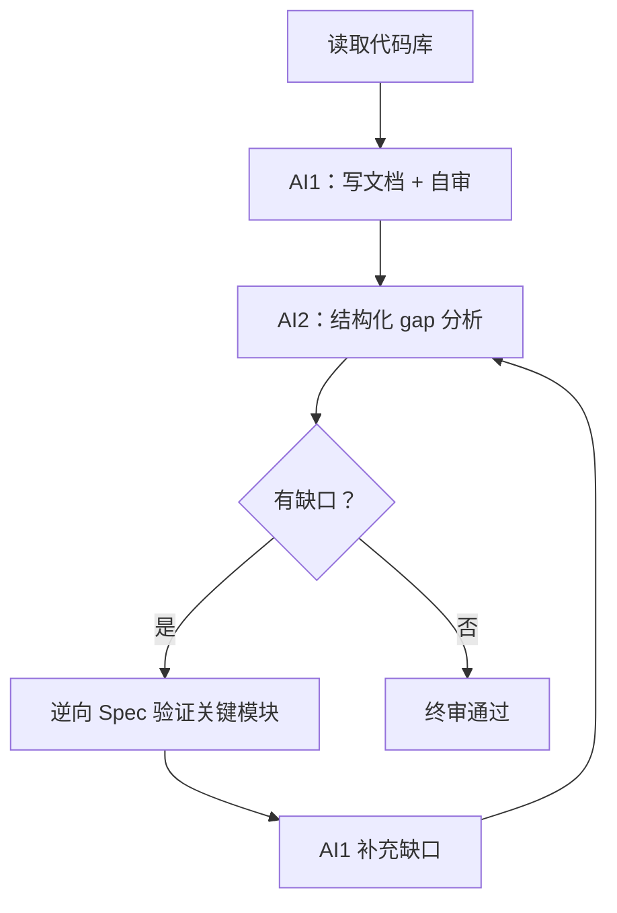

# 逆向模式：代码 → 文档

## 工作流



**核心原则**：代码是锚点。每条描述必须可追溯到代码或可观测行为。"写对"优先于"写全"——无法确认的内容标注 `[待确认]`，不编造。

## 代码结构 → 文档层映射

| 代码结构 | 识别特征 | 映射到文档层 | 提取内容 |
|---------|---------|------------|---------|
| 目录结构 | 顶层目录划分（`src/auth/`、`src/payment/`） | 域划分 / 模块列表 | 域名、模块边界、依赖方向 |
| ORM / 数据模型 | `models/`、`entities/`、`schema/`；装饰器 `@Entity`、`@Table`、`@Model` | 数据层 | 实体名、字段（名/类型/约束）、关系、索引 |
| API 路由 | `routes/`、`controllers/`、`handlers/`；装饰器 `@Get`、`@Post`；框架约定（Express `router`、FastAPI `@app`） | 接口层 | 端点路径、HTTP 方法、入参、出参、中间件（认证/限流） |
| 状态机 / 枚举 | `enum Status`、`sealed class`、`switch/case` on status field | 业务逻辑层 | 状态列表、事件列表、转移表、非法转移处理 |
| 业务服务 | `services/`、`usecases/`、`domain/`；核心函数（非 CRUD 的业务逻辑） | 业务逻辑层 | 业务规则、算法、边界条件、异常处理 |
| 配置文件 | `.env.example`、`config/`、`docker-compose.yml`、`Dockerfile` | setup.md | 环境变量、依赖服务、部署拓扑 |
| 中间件 / 拦截器 | `middleware/`、`interceptors/`、`guards/` | 接口层（认证）/ 全局约束 | 认证方式、权限模型、错误处理策略 |
| 测试文件 | `__tests__/`、`*_test.go`、`*_spec.rb` | 业务逻辑层（验证） | 边界条件、异常路径、业务规则的可执行规格 |

## 映射优先级

按信息密度排序扫描，避免在低价值文件上浪费时间：

1. **数据模型**（最高密度）：一个 Model 文件 = 实体 + 字段 + 关系 + 约束
2. **API 路由**：端点 + 入参 + 出参 + 错误码，结构化信息集中
3. **状态机 / 枚举**：业务规则的形式化表达，直接转为 stateDiagram-v2
4. **业务服务**：核心逻辑，需理解上下文，提取成本较高
5. **配置文件**：环境信息，简单但必要
6. **测试文件**：隐含的业务规则和边界条件，补充验证用

## 跨语言识别模式

| 语言/框架 | 数据模型 | API 路由 | 状态机 |
|----------|---------|---------|--------|
| Python/Django | `models.py`，`class X(models.Model)` | `urls.py`，`views.py` | `choices`，`TextChoices` |
| Python/FastAPI | Pydantic `BaseModel` | `@app.get/post` | `enum.Enum` |
| TypeScript/NestJS | `@Entity()`，TypeORM | `@Controller()`，`@Get()` | `enum`，`switch` |
| Go | `struct` + `gorm` tags | `http.HandleFunc`，gin `r.GET` | `iota` const block |
| Ruby/Rails | `ApplicationRecord` | `routes.rb`，`*_controller.rb` | `enum status:` |
| Java/Spring | `@Entity`，JPA | `@RestController`，`@RequestMapping` | `enum`，Spring SM |

## 无法映射时的处理

- **代码存在但文档层不明确**：标注 `[待确认：该逻辑属于哪个业务域？]`
- **逻辑分散在多处**：在文档中集中描述，标注所有代码来源
- **死代码 / 废弃功能**：跳过，不写入文档（有 `@deprecated` 标注则写入并标注"已废弃"）

## 逆向 Spec 技术

比"能不能开发"更精准的缺口发现方法：

```
请根据以下文档，写出 [模块名] 的前 50 行核心代码。
当你发现文档信息不足以继续时，停下来，列出你需要知道的具体问题。
不要猜测，不要用合理假设填补空白。写不下去就停。
```

写不下去的地方就是真正的缺口。
