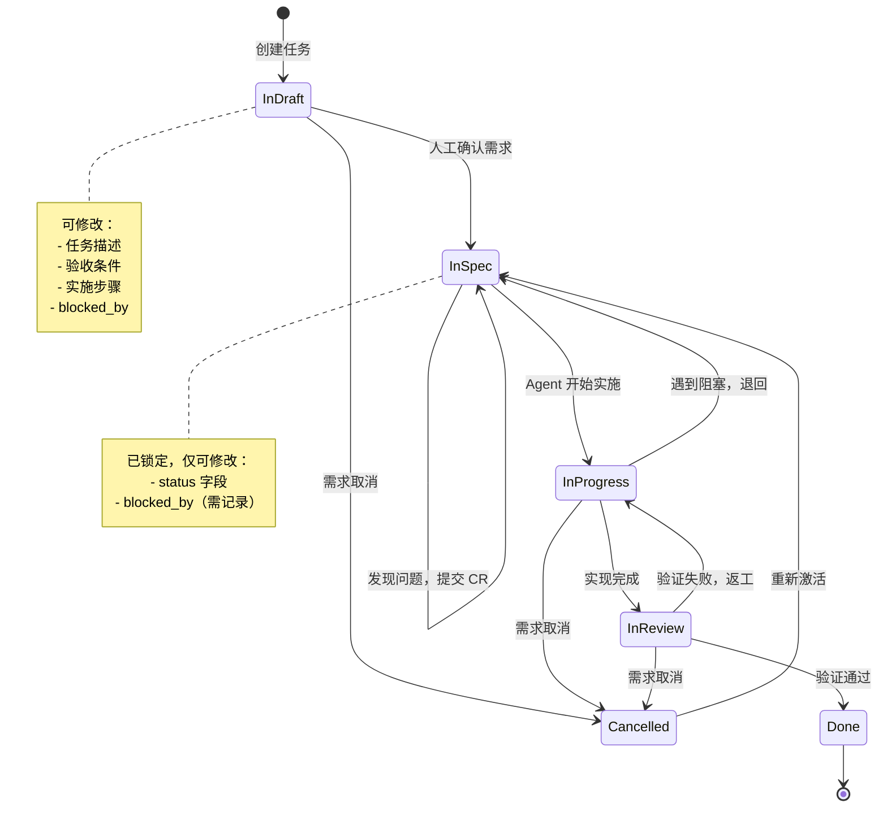
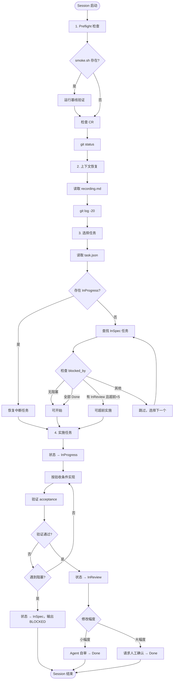
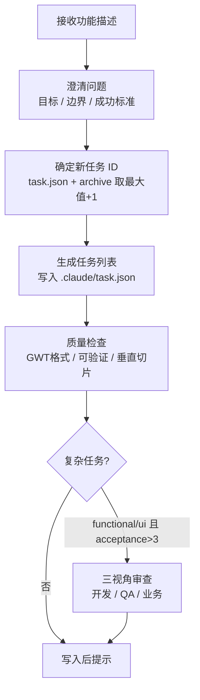
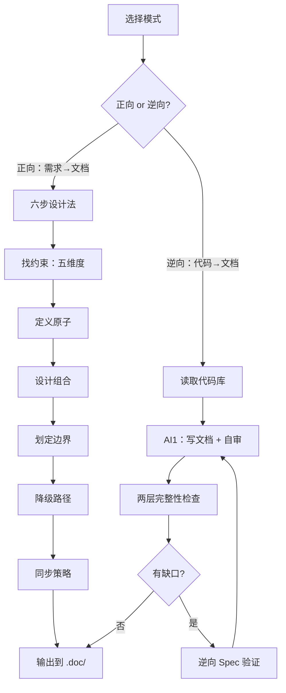

# diwu-workflow

[](https://github.com/ssdiwu/diwu-workflow/stargazers)
[](https://github.com/ssdiwu/diwu-workflow/blob/main/LICENSE)
[](https://github.com/ssdiwu/diwu-workflow)

diwu 编码工作流套件 — Claude Code 插件。提供项目初始化、任务规划、架构决策记录、产品文档四个工具，通过 Commands 主动触发，通过 Skills 自动激活，通过 Hooks 防止目标漂移。

---

## 安装

```
/plugin marketplace add ssdiwu/diwu-workflow
/plugin install diwu-workflow@ssdiwu
```

## 使用

| 命令 | 作用 | 自动触发场景 |
|------|------|------------|
| `/dinit` | 初始化项目工作流结构 | 新建项目、创建 CLAUDE.md |
| `/dplan` | 将功能描述拆解为任务列表 | 规划功能、分解需求 |
| `/dadr` | 记录架构决策（ADR） | 技术选型、不可逆约束 |
| `/ddoc` | 产品文档（正向/逆向两种模式） | 写文档、还原文档 |

---

## 核心工作流

### 任务状态机



### Session 生命周期



### /dplan 任务规划流程



### /ddoc 文档工作流



---

## Hooks

| Hook | 触发时机 | 作用 |
|------|---------|------|
| `PreToolUse` (Bash) | 每次执行 Bash 前 | 输出当前 InProgress 任务的 acceptance 条件，防止目标漂移 |
| `Stop` | 回合结束时 | 检查是否有未完成任务（InReview > 5 时豁免），防止遗漏 |

---

## 仓库结构

```
diwu-workflow/
├── .claude-plugin/
│   ├── plugin.json          # 插件描述
│   └── marketplace.json     # 市场索引
├── commands/                # 用户主动触发（/dinit 等）
│   ├── dinit.md
│   ├── dplan.md
│   ├── dadr.md
│   └── ddoc.md
├── skills/                  # Claude 自动加载的背景知识
│   ├── diwu-init/
│   ├── diwu-plan/
│   ├── diwu-adr/
│   └── diwu-doc/
└── hooks/
    └── hooks.json
```

---

## License

MIT
