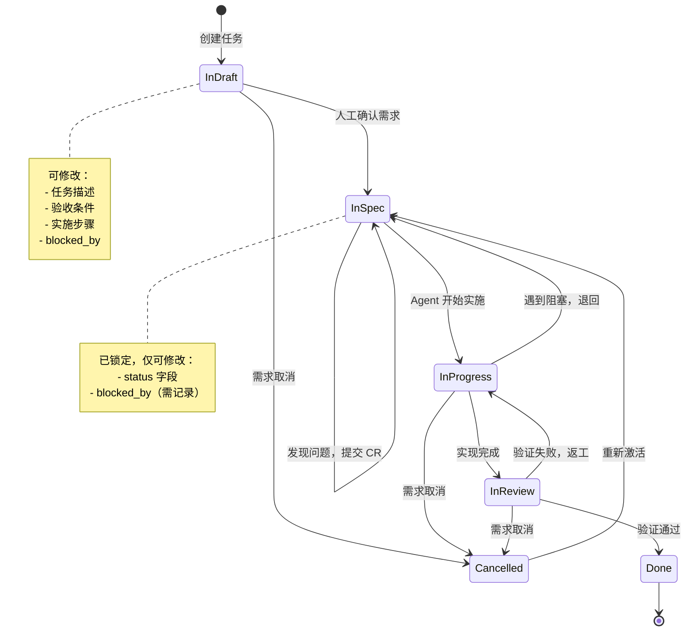
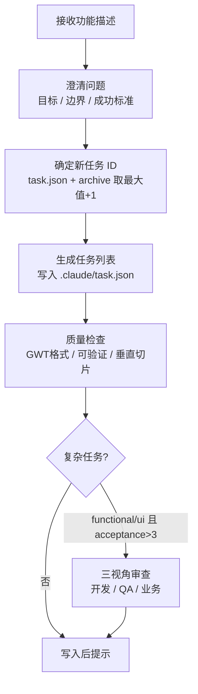
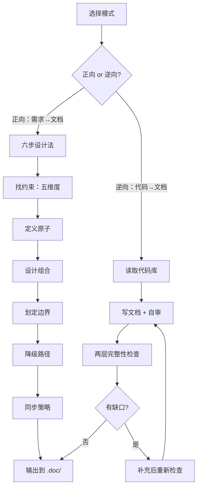

# diwu-workflow

[](https://github.com/ssdiwu/diwu-workflow/stargazers)
[](https://github.com/ssdiwu/diwu-workflow/blob/main/LICENSE)
[](https://github.com/ssdiwu/diwu-workflow)

diwu 编码工作流套件 — Claude Code 插件。让 AI 按照你确认的需求执行开发任务，而不是自行发挥。

---

## 典型工作流

### 新需求

```
/dprd          # 与产品讨论方案，生成 PRD
/dadr          # 有架构决策时记录（可选）
/ddoc          # 基于 PRD 正向生成产品文档
/dtask         # 将方案拆解为可执行任务列表
```

> 示例：要做一个「消息通知」功能 → 先 `/dprd` 讨论推送方式和触发条件，确定用 WebSocket 还是轮询时用 `/dadr` 记录决策，方案通过后 `/ddoc` 写产品文档，最后 `/dtask` 拆出具体任务。

### 已有项目

```
/ddoc          # 逆向还原现有代码的产品文档
/dprd          # 基于现有产品讨论新需求
/dadr          # 记录新的架构决策（可选）
/ddoc          # 正向补充新功能文档
/dtask         # 拆解新功能任务
```

> 示例：接手一个老项目 → 先 `/ddoc`（逆向模式）从代码还原文档，再用 `/dprd` 讨论要加的新功能，后续流程同「新需求」。

---

## 安装

```
/plugin marketplace add ssdiwu/diwu-workflow
/plugin install diwu-workflow@ssdiwu
```

## 使用

| 命令 | 作用 | 自动触发场景 |
|------|------|------------|
| `/dinit` | 初始化项目工作流结构 | 新建项目、创建 CLAUDE.md |
| `/dprd` | 生成产品需求文档（PRD） | 写 PRD、产品方案 |
| `/dadr` | 记录架构决策（ADR） | 技术选型、不可逆约束 |
| `/ddoc` | 产品文档（正向/逆向两种模式） | 写文档、还原文档 |
| `/dtask` | 将功能描述拆解为任务列表 | 规划功能、分解需求 |

---

## 核心工作流

### 任务状态机



#### 状态说明

| 状态 | 含义 | 谁可以操作 |
|------|------|-----------|
| `InDraft` | 需求草稿中，任务描述、验收条件、实施步骤均可自由修改 | 人工 + Agent |
| `InSpec` | 需求已确认并锁定，只有 `status` 字段可以修改 | 人工确认后由 Agent 推进 |
| `InProgress` | 实施中，Agent 正在按验收条件编写代码 | Agent |
| `InReview` | 实现完成，等待验证通过 | Agent 自审或人工确认 |
| `Done` | 验证通过，终态 | — |
| `Cancelled` | 已取消；可重新激活为 `InSpec` | 人工 |

**关键约束**：`InDraft` 任务 Agent 不会主动执行，必须由人工确认为 `InSpec` 后才会开始实施。

#### 状态转移规则

| 当前状态 | 触发事件 | 新状态 |
|---------|---------|--------|
| `InDraft` | 人工确认需求 | `InSpec` |
| `InSpec` | Agent 开始实施 | `InProgress` |
| `InSpec` | 发现需求问题 | 保持 `InSpec`，提交 Change Request |
| `InProgress` | 实现完成，准备验证 | `InReview` |
| `InProgress` | 遇到阻塞（缺环境/依赖不可用） | 退回 `InSpec`，输出 BLOCKED |
| `InReview` | 小幅修改，Agent 自审通过 | `Done` |
| `InReview` | 大幅修改（改 API 规范或 > 2000 行），人工确认 | `Done` |
| `InReview` | 验证失败 | 退回 `InProgress` |
| `Cancelled` | 需求重新激活 | `InSpec` |

#### task.json 字段说明

任务存储在 `.claude/task.json`，每个任务包含以下字段：

| 字段 | 类型 | 说明 |
|------|------|------|
| `id` | 数字 | 从 1 递增，永不复用 |
| `description` | 字符串 | 动词开头的一句话任务描述 |
| `status` | 字符串 | 见上方状态说明 |
| `acceptance` | 数组 | 验收条件，功能/UI/修复类必须用 `Given … When … Then …` 格式 |
| `steps` | 数组 | 实施步骤，须自包含（含外部凭据路径、绝对路径） |
| `category` | 字符串 | 见下方分类说明 |
| `blocked_by` | 数组 | 前置任务 ID 列表；前置任务全部 Done 后当前任务才可开始 |

`category` 可选值：

| 值 | 含义 | acceptance 格式要求 |
|----|------|-------------------|
| `functional` | 新增业务功能、API、核心逻辑 | 必须 Given/When/Then |
| `ui` | 页面、组件、交互、样式 | 必须 Given/When/Then |
| `bugfix` | 修复已知 bug | 必须 Given/When/Then |
| `refactor` | 不改变行为的代码结构优化 | 可用简单描述 |
| `infra` | 构建、部署、配置、脚本 | 可用简单描述 |

`acceptance` 示例：
```
"Given 用户已登录 When 点击退出按钮 Then 清除 token 并跳转登录页"
```

### Session 生命周期


### 异常处理

#### BLOCKED — 环境或依赖问题

当 Agent 遇到以下情况时，会停止任务并输出 BLOCKED，等待人工介入：

- 缺少环境配置（API 密钥、数据库连接）
- 外部依赖不可用（第三方服务宕机、需人工授权）
- 验证无法进行（需真实账号、依赖未部署的外部系统）

BLOCKED 时：任务退回 `InSpec`，禁止创建 commit，禁止标记 Done，在 `recording.md` 记录阻塞原因。人工介入后从 `InSpec` 恢复继续。

#### Change Request — 需求本身有问题

当执行 `InSpec` 任务时发现验收条件无法实现或存在矛盾，Agent 提交 Change Request：任务保持 `InSpec`，输出 CR 说明（原因、建议修改、影响评估），等待人工批准后更新 acceptance 继续实施。

#### 超前实施 — 前置任务还在 InReview

当前任务的前置任务处于 `InReview` 时，Agent 可超前执行后续任务（最多 5 个），超前任务完成时标记 `InReview` 并立即 commit。超前 5 个后暂停等待验收；若前置任务验收失败，协商回退方式（`git revert` / 保留修改 / `git reset`）。

---

## 设计理念

AI 擅长执行，不擅长决策。diwu-workflow 的核心主张是：**人负责决策，AI 负责操作**。所有需要判断的决策节点由人把关，Agent 只负责把确认过的事情做完、做对——它不能在需求草稿时开始写代码，不能在验证没过时提交 commit，也不能在遇到阻塞时假装完成。

工作流基于四个规范驱动开发的实践：

- **BDD**（行为驱动）：所有任务的验收条件用 Given/When/Then 格式写死，Agent 按此实现，不得自行解释需求
- **TDD**（测试驱动）：验证先于完成——未通过验收条件的任务不允许标记 Done，不允许提交 commit
- **SDD**（规范驱动）：产品文档（`/ddoc`）和架构决策（`/dadr`）在实施前落地，代码跟着规范走，不是规范跟着代码补
- **DDD**（领域驱动）：`/ddoc` 按功能域组织文档（`auth.md` / `billing.md` / …），每个任务只需加载对应域的文档，而不是整个代码库——遵循关注点分离原则，让 AI 读最少的上下文完成当前任务，同时降低跨域污染的风险

在此之上，用**强约束状态机**控制任务流转：

```
InDraft（草稿）→ InSpec（已锁定）→ InProgress（实施中）→ InReview（待验证）→ Done（完成）
```

状态机的核心约束是：系统在任意时刻只能处于一个明确的状态，且只有满足特定条件才能转移，所有不合法的转移直接被忽略。每个状态的边界由规则定义，不依赖 AI 的自我约束。

---

## 命令参考

### /dtask 任务规划流程



### /ddoc 文档工作流



---

## Hooks

| Hook | 触发时机 | 作用 |
|------|---------|------|
| `SessionStart` | session 启动时 | 将主代理 session ID 写入 `/tmp/.claude_main_session`，供 SubagentStop 过滤 stale 通知 |
| `PreToolUse` (Bash) | 每次执行 Bash 前 | 输出当前 InProgress 任务的 acceptance 条件，防止目标漂移 |
| `SubagentStop` | 子代理完成时 | 比对 session ID 过滤 stale（旧 session 残留）通知；当前 session 子代理完成后立即触发写 recording.md |
| `Stop` | 回合结束时 | 四分支任务循环：① 有 InProgress → block 继续当前任务；② InReview 积压 > 5 → 放行并通知人工验收；③ 有未阻塞的 InSpec → block 投喂下一任务；④ 全部完成 → 放行并通知完工。通知支持 macOS（系统通知+铃声）、Linux（notify-send）、终端铃声保底 |

---

## 仓库结构

```
diwu-workflow/
├── .claude-plugin/
│   ├── plugin.json          # 插件描述
│   └── marketplace.json     # 市场索引
├── commands/                # 用户主动触发（/dinit 等）
│   ├── dinit.md
│   ├── dtask.md
│   ├── dprd.md
│   ├── dadr.md
│   └── ddoc.md
├── skills/                  # Claude 自动加载的背景知识
│   └── diwu-doc/
├── assets/
│   └── dinit/               # /dinit 依赖的模板与规则
│       └── assets/
│           ├── *.template   # CLAUDE.md / task.json 等模板
│           └── rules/       # core-states / core-workflow 等规则文件
└── hooks/
    ├── hooks.json
    └── scripts/
```

---

## License

MIT
