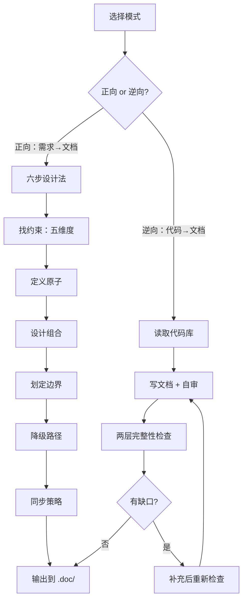
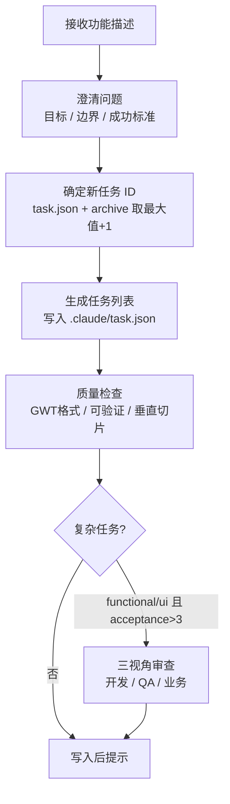
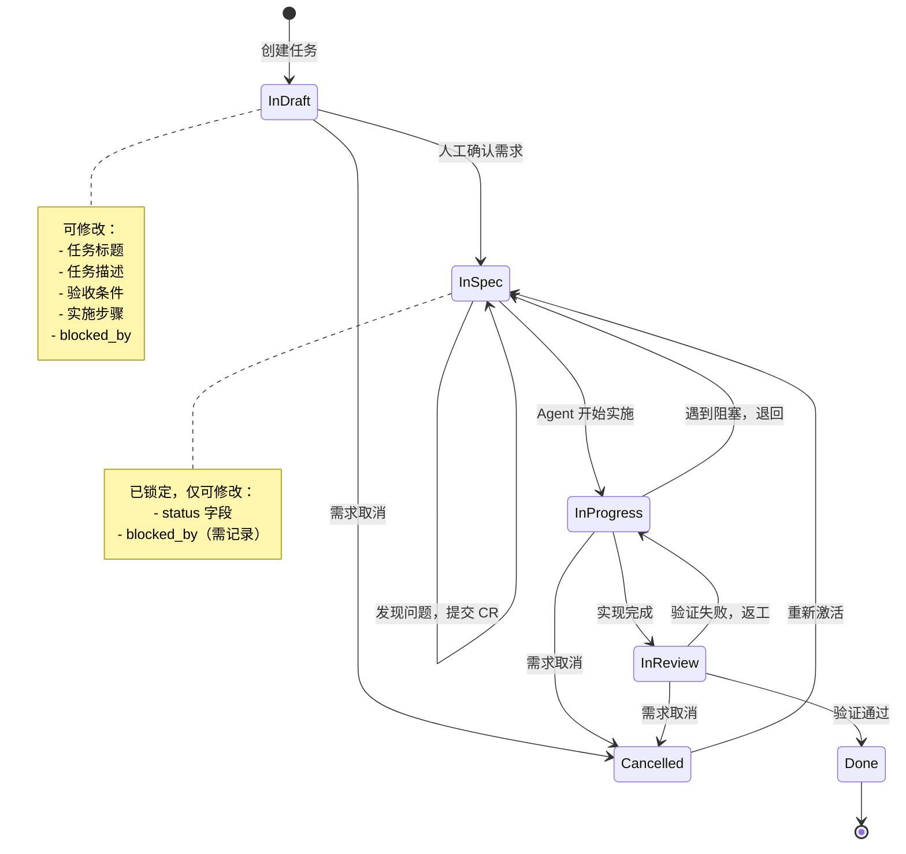
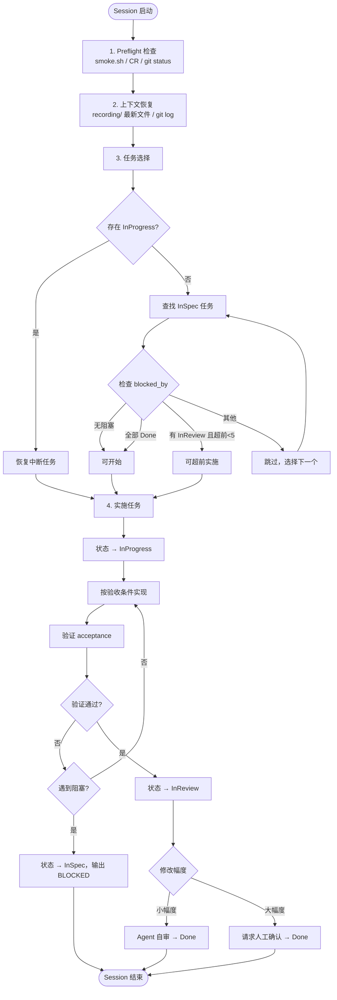

# diwu-workflow

[](https://github.com/ssdiwu/diwu-workflow/stargazers)
[](https://github.com/ssdiwu/diwu-workflow/blob/main/LICENSE)
[](https://github.com/ssdiwu/diwu-workflow)

diwu 编码工作流套件 — Claude Code 插件。让 AI 按照你确认的需求执行开发任务，而不是自行发挥。

---

## 安装

```
/plugin marketplace add ssdiwu/diwu-workflow
/plugin install diwu-workflow@ssdiwu
```

---

## 快速开始

### 新项目

```
/dinit          # 初始化工作流结构（CLAUDE.md / task.json / hooks / rules 13 文件）
/dprd           # 讨论方案，生成 PRD，识别 Demo 需求
/dadr           # 有架构决策时记录（可选）
/ddoc           # 基于 PRD 正向生成产品文档
/ddemo          # 对每个 Demo 需求生成落地方案
/dtask          # Demo 验证通过后，拆解集成任务列表
```

> 示例：做「消息通知」功能 → `/dprd` 讨论推送方式，确定用 WebSocket 时 `/dadr` 记录决策，方案通过后 `/ddoc` 写产品文档，`/ddemo` 为不确定功能点（如 Prompt 稳定性）生成验证方案，通过后 `/dtask` 拆集成任务。

### 接手老项目

```
/ddoc           # 逆向还原现有代码的产品文档
/dprd           # 基于现有产品讨论新需求
/dadr           # 记录新的架构决策（可选）
/ddoc           # 正向补充新功能文档
/dtask          # 拆解新功能任务
```

---

## 命令参考

| 命令 | 作用 |
|------|------|
| `/dinit` | 初始化项目工作流结构（13 个 rules 文件 + 迁移检测） |
| `/dprd` | 生成产品需求文档（PRD） |
| `/dadr` | 记录架构决策（ADR） |
| `/ddoc` | 产品文档（正向/逆向两种模式） |
| `/ddemo` | 针对单个不确定性功能点，生成完整落地方案 |
| `/dtask` | 将功能描述拆解为任务列表 |
| `/dcorr` | 纠偏恢复协议（四行重写 → 误判排查 → 重判门控 → 恢复骨架） |

每个命令的约束表说明「必须同时为真的约束集合」——违反任一约束，输出即不可信。

### /dinit

| 维度 | 约束 |
|-----|------|
| 业务 | 已存在的文件不覆盖（幂等）；规则文件写入 `.claude/rules/`，不内联到 CLAUDE.md |
| 时序 | 收集信息 → 创建文件 → 验证清单；不可跳过信息收集直接创建文件 |
| 跨命令 | 创建的 `.claude/task.json` 结构必须与 `/dtask` 写入格式兼容 |
| 感知 | 验证清单全部通过才算完成；缺少任一文件不算初始化成功 |

### /dprd

| 维度 | 约束 |
|-----|------|
| 业务 | Layer 0 未通过时 Layer 1 不得开始；不写 task.json；不生成代码；Demo 需求名称必须用 kebab-case |
| 时序 | 确认定位 → Q1-Q8 逐问（每次只问一个）→ 检查已有 PRD → **脊梁提炼（用户确认）→ 论证链设计（用户确认）→ 积木选取 → 反模式门禁** → 写入 → 自检 |
| 跨命令 | PRD README 的 Demo 需求列是 `/ddemo` 的输入；`.doc/README.md` 和 `.doc/adr/README.md` 是 Q5 的前置读取 |
| 感知 | 交付前自检：智能引号 0 命中、绝对路径 0 命中、乱码 0 命中；否则不可交付 |

### /dadr

| 维度 | 约束 |
|-----|------|
| 业务 | 同一决策只有一个 ADR（更新不新建）；Context 必须有具体数字；Consequences 的 ⚠️ 必须有触发条件和解决路径 |
| 时序 | 先读 README 判断新建/更新 → 写文件 → 更新 README；不可先写文件再判断 |
| 跨命令 | ADR README 是 `/dprd` Q5 的输入；ADR 编号格式 `ADR-NNN` 是 `/dtask` steps 引用的依据 |
| 感知 | 备选方案的缺点必须是具体技术风险和触发条件，不允许「复杂度高」等模糊描述 |

### /ddoc

| 维度 | 约束 |
|-----|------|
| 业务 | 代码是锚点，无法确认的内容标注 `[待确认]`，不编造；逆向模式不写 task.json（大范围除外） |
| 时序 | 写文档 → 自审 → gap 分析（两层）→ 补充缺口 → 再次 gap 分析；gap 分析必须在自审之后 |
| 跨命令 | `.doc/README.md` 是所有命令的入口；每次写入文档后必须同步更新 README（通用货币维护义务） |
| 感知 | 有状态实体必须有 stateDiagram；核心业务流程必须有 flowchart；数据实体关系必须有 erDiagram |


```mermaid
flowchart TD
    A[选择模式] --> B{正向 or 逆向?}

    B -->|正向：需求→文档| C[六步设计法]
    C --> C1[找约束：五维度]
    C1 --> C2[定义原子]
    C2 --> C3[设计组合]
    C3 --> C4[划定边界]
    C4 --> C5[降级路径]
    C5 --> C6[同步策略]
    C6 --> Out[输出到 .doc/]

    B -->|逆向：代码→文档| D[读取代码库]
    D --> E[写文档 + 自审]
    E --> F[两层完整性检查]
    F --> G{有缺口?}
    G -->|是| H[补充后重新检查]
    H --> E
    G -->|否| Out
```

### /ddemo

| 维度 | 约束 |
|-----|------|
| 业务 | 每次只处理一个 Demo；两级门控（先判产品类型，再判能力 vs 功能）；核心验证资产篇幅 > 50%；不写生产架构；不写 task.json |
| 时序 | 两级门控 → 读 README（不全量扫描）→ 建立上下文 → 生成 → 写入 → 更新 Demo README |
| 跨命令 | Demo 文件路径格式 `DEMO-{kebab-case-name}-spec.md` 是 `/dtask` 的查找依据；通过标准必须可量化（供 `/dtask` acceptance 引用） |
| 感知 | 核心验证资产必须可直接运行（Prompt 全文 / 测试矩阵 / 测试脚本），不允许伪代码占位 |

### /dtask

| 维度 | 约束 |
|-----|------|
| 业务 | task ID 永不复用（跨 task.json 和 archive）；functional/ui/bugfix 类 acceptance 必须 GWT 格式；steps 必须自包含（绝对路径，无隐式上下文依赖） |
| 时序 | 先确定最大 ID → 澄清问题 → 生成 → 质量检查 → 可选三视角审查 → 写入；ID 确定必须在生成之前 |
| 跨命令 | 写入的 task.json 是工作流引擎（hooks + Session 启动）的输入；blocked_by 引用的 ID 必须存在于 task.json 或 archive |
| 感知 | 质量检查发现问题时必须列出具体问题 + 建议修正，不可静默写入 |


```mermaid
flowchart TD
    A[接收功能描述] --> B[澄清问题<br>目标 / 边界 / 成功标准]
    B --> C[确定新任务 ID<br>task.json + archive 取最大值+1]
    C --> D[生成任务列表<br>写入 .claude/task.json]
    D --> E[质量检查<br>GWT格式 / 可验证 / 垂直切片]
    E --> F{复杂任务?}
    F -->|functional/ui 且 acceptance>3| G[三视角审查<br>开发 / QA / 业务]
    F -->|否| H[写入后提示]
    G --> H
```

---

## 工作流机制

### 任务状态机


```mermaid
stateDiagram-v2
    [*] --> InDraft: 创建任务
    InDraft --> InSpec: 人工确认需求
    InDraft --> Cancelled: 需求取消

    InSpec --> InProgress: Agent 开始实施
    InSpec --> InSpec: 发现问题，提交 CR

    InProgress --> InReview: 实现完成
    InProgress --> InSpec: 遇到阻塞，退回
    InProgress --> Cancelled: 需求取消

    InReview --> Done: 验证通过
    InReview --> InProgress: 验证失败，返工
    InReview --> Cancelled: 需求取消

    Done --> [*]
    Cancelled --> InSpec: 重新激活

    note right of InDraft
        可修改：
        - 任务标题
        - 任务描述
        - 验收条件
        - 实施步骤
        - blocked_by
    end note

    note right of InSpec
        已锁定，仅可修改：
        - status 字段
        - blocked_by（需记录）
    end note
```

| 状态 | 含义 | 谁可以操作 |
|------|------|-----------|
| `InDraft` | 需求草稿中，所有字段均可自由修改 | 人工 + Agent |
| `InSpec` | 需求已确认并锁定，只有 `status` 字段可以修改 | 人工确认后由 Agent 推进 |
| `InProgress` | 实施中，Agent 正在按验收条件编写代码 | Agent |
| `InReview` | 实现完成，等待验证通过 | Agent 自审或人工确认 |
| `Done` | 验证通过，终态 | — |
| `Cancelled` | 已取消；可重新激活为 `InSpec` | 人工 |

**关键约束**：`InDraft` 任务 Agent 不会主动执行，必须由人工确认为 `InSpec` 后才会开始实施。

`acceptance` 格式：功能 / UI / 修复类任务必须用 `Given … When … Then …`，验证前必须逐条通过。

```
"Given 用户已登录 When 点击退出按钮 Then 清除 token 并跳转登录页"
```

### Session 生命周期

每个 session 启动时按固定顺序执行：


```mermaid
flowchart TD
    Start([Session 启动]) --> Preflight[1. Preflight 检查<br>smoke.sh / CR / git status]
    Preflight --> Context[2. 上下文恢复<br>recording/ 最新文件 / git log]
    Context --> SelectTask[3. 任务选择]

    SelectTask --> CheckInProgress{存在 InProgress?}
    CheckInProgress -->|是| ResumeTask[恢复中断任务]
    CheckInProgress -->|否| FindInSpec[查找 InSpec 任务]

    FindInSpec --> CheckBlocked{检查 blocked_by}
    CheckBlocked -->|无阻塞| CanStart[可开始]
    CheckBlocked -->|全部 Done| CanStart
    CheckBlocked -->|有 InReview 且超前<5| CanAdvance[可超前实施]
    CheckBlocked -->|其他| SkipTask[跳过，选择下一个]
    SkipTask --> FindInSpec

    CanStart --> Implement[4. 实施任务]
    CanAdvance --> Implement
    ResumeTask --> Implement

    Implement --> SetInProgress[状态 → InProgress]
    SetInProgress --> CodeImpl[按验收条件实现]
    CodeImpl --> Verify[验证 acceptance]

    Verify --> VerifyOK{验证通过?}
    VerifyOK -->|否| Blocked{遇到阻塞?}
    Blocked -->|是| SetInSpec[状态 → InSpec，输出 BLOCKED]
    Blocked -->|否| CodeImpl

    VerifyOK -->|是| SetInReview[状态 → InReview]
    SetInReview --> CheckScope{修改幅度}
    CheckScope -->|小幅度| AgentReview[Agent 自审 → Done]
    CheckScope -->|大幅度| HumanReview[请求人工确认 → Done]

    AgentReview --> End
    HumanReview --> End
    SetInSpec --> End([Session 结束])
```

**分层记忆**：Session 上下文由两个文件分工维护：

| 文件 | 回答的问题 | 写入时机 |
|------|-----------|---------:|
| `recording/` | 发生了什么（session 流水、任务进度、下一步），每个 session 一个独立文件 | 每次 session 结束时 |
| `decisions.md` | 为什么这样设计（方案选择、边界定义、设计方向） | 有重大设计决策时 |

**归档机制**：

- **task.json 归档**：Done/Cancelled 任务超过 20 个时，自动归档到 `archive/task_archive_YYYY-MM.json`
- **recording/ 归档**：session 文件超过 50 个时，保留最近 30 天的文件，其余打包到 `archive/recording_archive_YYYY-MM.tar.gz`

归档阈值可在 `.claude/dsettings.json` 中配置（`task_archive_threshold` / `recording_archive_threshold` / `recording_retention_days`）。

**通用货币：README 索引**

命令之间通过 README 索引传递信息，不直接扫描对方的输出文件：

```
.doc/README.md        ← /ddoc 维护，/dprd /ddemo 读取
.doc/prd/README.md    ← /dprd 维护，/ddemo /dtask 读取
.doc/demo/README.md   ← /ddemo 维护，/dtask 读取
.doc/adr/README.md    ← /dadr 维护，/dprd 读取
```

### 异常处理

#### BLOCKED — 环境或依赖问题

当 Agent 遇到以下情况时，停止任务并输出 BLOCKED，等待人工介入：

- 缺少环境配置（API 密钥、数据库连接）
- 外部依赖不可用（第三方服务宕机、需人工授权）
- 验证无法进行（需真实账号、依赖未部署的外部系统）

BLOCKED 时：任务退回 `InSpec`，禁止创建 commit，禁止标记 Done，在 `recording/` 记录阻塞原因。人工介入后从 `InSpec` 恢复继续。

#### Change Request — 需求本身有问题

执行 `InSpec` 任务时发现验收条件无法实现或存在矛盾，Agent 提交 Change Request：任务保持 `InSpec`，输出 CR 说明（原因、建议修改、影响评估），等待人工批准后更新 acceptance 继续实施。

#### 超前实施 — 前置任务还在 InReview

前置任务处于 `InReview` 时，Agent 可超前执行后续任务（最多 5 个），超前任务完成时标记 `InReview` 并立即 commit。超前 5 个后暂停等待验收。

前置任务验收失败时，人工决定回退方式：

| 方式 | 适用场景 |
|------|---------|
| `revert` | 超前任务已 push 到远端，需撤销公开提交 |
| `reset --soft` | 超前任务只在本地，保留代码改动但撤销 commit |
| `修改` | 超前任务代码仍有效，只需调整以适配阻塞任务的新实现 |

### 规则体系（v1.0：13 文件架构）

规则文件按职责分离，每个文件 ≤ 200 行。由 `rules-manifest.json` 管理清单，`/dinit` 按此列表安装到项目 `.claude/rules/`。

| 层级 | 文件 | 用途 | 注入方式 |
|------|------|------|---------|
| **上位心智** | `mindset.md` | 三唯一框架、五问开工、不确定性门控、三层工程论 | 独立全量注入 |
| **判断锚点** | `judgments.md` | 四段式索引（启动/实施/验收/纠偏）+ 入口门控 | rfs 精简索引 |
| **任务引擎** | `task.md` | 状态机、GWT acceptance、task.json 结构、blocked_by、提交规范 | rfs 精简索引 |
| **工作流** | `workflow.md` | 任务规划、实施、验证（Session 见 session.md） | rfs 精简索引 |
| **会话管理** | `session.md` | Session 生命周期（Preflight/上下文/归档/选择/结束/continuous_mode） | rfs 精简索引 |
| **证据优先级** | `verification.md` | L1-L5 五级证据、Done 判定门槛、无法验证处理 | rfs 精简索引 |
| **纠偏体系** | `correction.md` | 退化信号检测、四行重写、止损序列、BLOCKED 边界 | rfs 精简索引 |
| **误判防护** | `pitfalls.md` | 三层防护（泛化模式/项目高频/接口预留 v2） | rfs 精简索引 |
| **异常处理** | `exceptions.md` | BLOCKED 判定、阻塞恢复流程 | rfs 精简索引 |
| **格式模板** | `templates.md` | DECISION TRACE/BLOCKED/REVIEW 格式、最小规格、退化对照表、可调参数 | rfs 精简索引 |
| **文件布局** | `file-layout.md` | .claude/ 目录结构、归档规则 | rfs 精简索引 |
| **架构约束** | `constraints.md` | 五维约束设计、版本号语义化、Degradation Paths | 独立全量注入 |

**规则可执行性三层**：

- **程序性规则**（固定步骤、状态机）：用列表定义，靠结构保证执行
- **判断性规则**（分类、取舍、边界判定）：必须附正例 / 反例 / 边界例锚点，靠示例保证执行
- **边界**：「谁的问题谁解决」，不跨层污染

约束强度：**无标注 = 强制约束**，`[建议]` = 软约束（可偏离但需记录）。

### 思维框架：从现象到动作

所有规则都是「现象 → 判断 → 动作」这条链的具体实例。违反这条链的规则是空壳，缺少这条链的工作是空转。

| 环节 | 含义 | 常见缺失 |
|------|------|---------|
| **现象** | 看到了什么（事实、数据、异常） | 抽象描述代替具体观察 |
| **判断** | 据此得出什么结论（依据什么） | 跳步到动作，或缺少依据 |
| **动作** | 接下来要做什么（具体行动） | 停在理解层，不推动执行 |

本工作流中「现象 → 判断 → 动作」的具体体现：

- **不确定性决策节点**：现象 = 任务特征，判断 = 是否可预期，动作 = 直接推进或先 Demo
- **DECISION TRACE**：结构化输出「现象 → 判断 → 动作」三段论的工具
- **acceptance 验证**：动作完成后的现象观察，判断依据是 acceptance 是否通过
- **BLOCKED 报告**：现象 = 真实阻塞点，判断 = 环境/凭据缺失，动作 = 人工介入

这条框架优先于任何具体规则。当规则和框架冲突时，先检查是否真的满足了三段论。

关键判断节点（任务选择、CR/BLOCKED 判定、大幅度修改判定等）统一输出 `DECISION TRACE`：

```
DECISION TRACE

结论: [BLOCKED | CHANGE REQUEST | CONTINUE | REVIEW | SKIP]

规则命中: [命中的规则条目]
证据: [task.json 状态 / 测试日志 / git diff --stat]  ← 现象
排除项: [为什么不是其他结论]                          ← 判断
下一步: [立即执行的动作]                                ← 动作
```

---

## 内置 Agents（10 个，自定义 Agent 分层架构）

### 分层总览

#### 职责层（按工作流角色划分）

| 层级 | Agent 数量 | 定位 | 触发方式 |
|------|-----------|------|---------|
| **核心层** | 3 个 | 工作流主链角色：探索、实施、验收 | 自动委派 / 主代理调度 |
| **领域层** | 7 个 | 按需可用的专家顾问，处理特定技术领域问题 | 自然语言描述 / @mention |

#### 部署层（按 Claude Code 加载位置划分）

| 层级 | Agent 数量 | 存放位置 | 说明 |
|------|-----------|---------|------|
| **项目级** | 3 个 | `.claude/agents/` | `explorer`、`implementer`、`verifier`，随项目上下文一起工作 |
| **插件级** | 7 个 | `agents/` | 7 个领域专家，由插件提供通用顾问能力 |

**选择指南**：日常任务流转走核心层（explorer → implementer → verifier）；遇到特定技术领域问题时召唤领域层专家。`verifier` 在职责上属于核心层，但在部署上属于项目级 Agent，因为它需要读取项目内的 `.claude/task.json`、acceptance 和状态机。

---

### 核心 Agent（工作流闭环的三个角色）

#### explorer — 探索者（只读）

| 属性 | 说明 |
|------|------|
| **定位** | 只读探索代码库，不修改文件，保护主对话上下文不被探索过程污染 |
| **权限模式** | `plan`（只读） |
| **工具集** | Read、Grep、Glob、LSP、WebSearch、WebFetch |
| **最大轮次** | 20 |
| **典型场景** | 代码库调查、架构分析、文件搜索、依赖追踪、技术调研、模块边界识别 |
| **工作流衔接点** | InProgress 前的「先探索验证」路径；子代理策略中的只读探索角色 |

#### implementer — 实施者（唯一可写角色）

| 属性 | 说明 |
|------|------|
| **定位** | 代码修改、功能实现、bug 修复，核心层中唯一拥有写权限的角色 |
| **权限模式** | `acceptEdits`（自动接受编辑） |
| **工具集** | Read、Grep、Glob、Edit、Write、Bash、LSP |
| **最大轮次** | 100 |
| **典型场景** | 功能实现、bug 修复、重构执行、配置变更、测试编写 |
| **工作流衔接点** | InSpec → InProgress 后的主实施者；并行子代理中的写操作执行者；交接清单的产出方 |

#### verifier — 验证者（独立验收）

| 属性 | 说明 |
|------|------|
| **定位** | 独立验收，从 acceptance 反推可观测事实并验证实现是否达标。核心理念：Task completion ≠ Goal achievement |
| **权限模式** | `plan`（只读） |
| **工具集** | Read、Grep、Glob、Bash |
| **最大轮次** | 30 |
| **典型场景** | 任务 InReview 后自动触发；独立于实施者运作，防止"自说自话"宣称完成 |
| **工作流衔接点** | InReview → Done 的守门人；输出三档报告驱动状态转移决策 |

**verifier 完整工作流**：

```
任务 InReview → verifier 被派发
    ↓
Step 1: 读 task.json 提取 acceptance（GWT 解析：Given/When/Then）
    ↓
Step 2: 从 Then 子句反推可观测事实
        （文件存在？签名匹配？行为正确？测试通过？产物生成？）
    ↓
Step 3: 独立验证（文件级 Grep/Read/Glob → 脚本级 Bash 执行 → 请求级 curl/CLI）
    ↓
Step 4: Stub Pattern 扫描（6 类：TODO/FIXME、占位字符串、空实现、
        硬编码数据、未实现异常、废弃标记）
    ↓
Step 5: 输出三档报告
        ├─ PASSED     — 全部 L1-L3 证据 + Stub CLEAN
        ├─ GAPS_FOUND — 部分缺乏证据或发现 stub → 给修复方向
        └─ HUMAN_NEEDED — 超出工具判断能力 → 明确列出需人工确认项
```

**verifier 铁律**：
1. 不读 `recording/` 目录（避免被实施者叙述影响）
2. 不信任 implementer 自述（只信工具独立观测的事实）
3. 不假设"代码改了 = 功能做了"（必须运行态验证）
4. 遇不确定输出 `HUMAN_NEEDED`（绝不猜测）

---

### 领域 Agent（按需召唤的专家顾问）

| Agent | 中文名 | 触发时机 | 典型场景 |
|-------|--------|---------|---------|
| `ui-designer` | UI 设计师 | 涉及 UI/UX 设计决策时 | 组件设计系统、无障碍合规、CSS/布局诊断、设计 token 规范 |
| `backend-architect` | 后端架构师 | 涉及服务端架构时 | API 设计、数据库 schema、服务拆分、性能瓶颈、缓存策略 |
| `frontend-architect` | 前端架构师 | 涉及前端架构时 | 状态管理选型、组件架构、构建优化、bundle 分析 |
| `api-tester` | API 测试员 | 涉及测试策略时 | 契约测试、边界用例、多语言测试框架（Python/JS/Go/Clojure） |
| `devops-architect` | DevOps 架构师 | 涉及运维部署时 | CI/CD 流水线、容器化策略、基础设施即代码、监控告警 |
| `performance-optimizer` | 性能优化师 | 涉及性能问题时 | 瓶颈分析、前端加载优化、数据库查询优化、缓存策略设计 |
| `legal-compliance` | 法律合规顾问 | 涉及法规要求时 | 隐私政策（GDPR/CCPA）、数据处理合规、用户权利、知识产权 |

> 领域 Agent 通过自然语言描述或 `@agent-name` 方式触发，不参与自动任务流转。它们是独立开发者的「专家咨询台」，在需要专业领域知识时按需调用。

---

### 项目级 Agent（/dinit 初始化时创建）

| Agent | permissionMode | maxTurns | 用途 |
|-------|---------------|----------|------|
| `explorer` | plan（只读） | 20 | 代码库调查、架构分析、文件搜索、技术调研（核心层：探索者） |
| `implementer` | acceptEdits（自动接受编辑） | 100 | 代码修改、功能实现、bug 修复、重构执行（核心层：实施者） |
| `verifier` | plan（只读） | 30 | 独立验收、从 acceptance 反推可观测事实并输出验证报告（核心层：验证者） |

> 项目级 Agent 位于 `.claude/agents/` 目录，由 `/dinit` 从模板复制生成。每个初始化后的项目拥有独立副本，可按项目需求定制 description 和工具集。`verifier` 放在这里而不是插件根目录，是因为它必须读取项目内的 `.claude/task.json` 和当前任务状态。

---

### Agent 使用指南

#### 如何触发 Agent

| 方式 | 说明 | 示例 |
|------|------|------|
| **自然语言描述** | 在对话中描述需要某类专家协助 | "帮我分析一下这个 API 的性能瓶颈" → 自动匹配合适的领域 Agent |
| **@mention** | 直接指定 Agent 名称 | "@backend-architect 帮我设计用户认证的 API schema" |
| **自动委派** | 核心层 Agent 由工作流自动调度 | InProgress → implementer；InReview → verifier；探索阶段 → explorer |

#### 核心 vs 领域选择指南

```
问题类型判断：
├─ 是代码修改/实现？       → implementer（核心层）
├─ 是代码库探索/调查？     → explorer（核心层）
├─ 是任务完成后的验收？   → verifier（核心层）
├─ 是 UI/UX 相关？         → ui-designer（领域层）
├─ 是后端/API/数据库？     → backend-architect（领域层）
├─ 是前端/状态管理/构建？  → frontend-architect（领域层）
├─ 是测试策略/契约测试？   → api-tester（领域层）
├─ 是 CI/CD/部署/运维？    → devops-architect（领域层）
├─ 是性能优化？            → performance-optimizer（领域层）
└─ 是法律/合规/隐私？      → legal-compliance（领域层）
```

#### verifier 典型工作流示例

```
1. implementer 完成 Task#12（用户注册功能），标记 InReview
2. 主代理调度 verifier 验证 Task#12
3. verifier 读 task.json → 提取 3 条 GWT acceptance
4. 反推可观测事实：
   - GWT-1: Given 用户邮箱 When POST /api/register Then 返回 201 + user ID
     → 反推: curl -X POST http://localhost:3000/api/register 断言 HTTP 201 + body 含 id
   - GWT-2: Given 重复邮箱 When 注册 Then 返回 409
     → 反推: 相同邮箱二次注册断言 HTTP 409
   - GWT-3: Given 无效邮箱格式 When 注册 Then 返回 400 + 错误信息
     → 反推: 非法格式断言 HTTP 400 + body 含 error 字段
5. Bash 执行请求验证 → Glob/Grep 检查路由定义 → Read 检查字段签名
6. Stub 扫描 → 发现 0 个非测试 stub
7. 输出: VERIFICATION REPORT Task#12 Status: PASSED
8. 主代理判定: 小幅度修改 + PASSED → 自审 Done
```

---

## Hooks

所有 hook 逻辑已外部化到 `hooks/scripts/*.py`，hooks.json 仅引用外部脚本。

| Hook | 触发时机 | 脚本 | 作用 |
|------|---------|------|------|
| `UserPromptSubmit` | 用户发送消息前 | `user_prompt_submit.py` | 注入 lessons + constraints(全量) + mindset(全量/独立) + rules 精简索引 |
| `SessionStart` | session 启动时 | `session_start.py` | 写主代理 session ID；读取 `.claude/env` 注入环境变量 |
| `PreToolUse` (Edit\|Write\|Bash\|Read\|Grep\|Glob) | 大部分工具调用前 | `drift_detect_pre.py` + `pre_tool_use_bash.py` + `inject_errors_decisions.py` | 退化信号检测 + 任务提醒 + **近期踩坑/决策注入**（注意力操纵） |
| `SubagentStart` | 子代理启动时 | `subagent_start.py` | 自动注入 recording/ 最新摘要 + InProgress 任务 + 最近决策到子代理上下文 |
| `SubagentStop` | 子代理完成时 | `subagent_stop.py` | 读取 `last_assistant_message` 自动记录子代理产出摘要到 recording/ |
| `PreCompact` | 对话压缩前 | `pre_compact.py` | 自动保存 InProgress 任务进度快照（git diff --stat）到 recording/ |
| `PostToolUse` (Write/Edit) | 写入文件后 | `post_tool_json_validate.py` + `post_tool_reminder.py` | JSON 格式校验 + **记录提醒**（含未解决失败检测） |
| `PostToolUse` (通用) | 每次工具调用后 | `context_monitor.py` | Context Rot 监控（**WARNING@30次 / CRITICAL@50次**）+ 只读连击检测（≥15次提醒） |
| `Stop` (background) | 回合结束（后台） | `stop_background.py` | git diff --stat 变更快照（session 窗口内去重，不含 untracked 噪声） |
| `Stop` (blocking) | 回合结束（前台） | `stop_blocking.py` | continue 机制 + 完整性检查(踩坑必填) + 归档聚合(project-pitfalls) |
| `PostToolUseFailure` | 工具执行失败时 | `post_tool_use_failure.py` | **3-Strike 错误协议**（自动计数+分级提示：诊断/换方法/停手重想） |
| `TaskCompleted` | 任务完成时 | `task_completed.py` | **任务完成提醒**（确认 recording 已写入 + decisions 已更新） |

---

## 设计理念

AI 擅长执行，不擅长决策。diwu-workflow 的核心主张是：**人负责决策，AI 负责操作**。所有需要判断的决策节点由人把关，Agent 只负责把确认过的事情做完、做对——它不能在需求草稿时开始写代码，不能在验证没过时提交 commit，也不能在遇到阻塞时假装完成。

工作流基于四个规范驱动开发的实践：

- **BDD**（行为驱动）：所有任务的验收条件用 Given/When/Then 格式写死，Agent 按此实现，不得自行解释需求
- **TDD**（测试驱动）：验证先于完成——未通过验收条件的任务不允许标记 Done，不允许提交 commit
- **SDD**（规范驱动）：产品文档（`/ddoc`）和架构决策（`/dadr`）在实施前落地，代码跟着规范走，不是规范跟着代码补
- **DDD**（领域驱动）：`/ddoc` 按功能域组织文档（`auth.md` / `billing.md` / …），每个任务只需加载对应域的文档，而不是整个代码库

在此之上，用**强约束状态机**控制任务流转：

```
InDraft（草稿）→ InSpec（已锁定）→ InProgress（实施中）→ InReview（待验证）→ Done（完成）
```

状态机的核心约束是：系统在任意时刻只能处于一个明确的状态，且只有满足特定条件才能转移，所有不合法的转移直接被忽略。每个状态的边界由规则定义，不依赖 AI 的自我约束。

---

## 仓库结构

```
diwu-workflow/
├── .claude-plugin/
│   ├── plugin.json          # 插件描述（v0.7.7）
│   └── marketplace.json     # 市场索引
├── .claude/
│   └── agents/              # 项目级 agents（3 个：explorer / implementer / verifier）
│       ├── explorer.md
│       ├── implementer.md
│       └── verifier.md      # 核心层：独立验证者
├── agents/                  # 插件级领域 agents（7 个）
│   ├── ui-designer.md
│   ├── backend-architect.md
│   ├── frontend-architect.md
│   ├── api-tester.md
│   ├── devops-architect.md
│   ├── performance-optimizer.md
│   └── legal-compliance.md
│   ├── dinit.md             # 初始化工作流结构（13 rules + 迁移检测）
│   ├── dprd.md              # 生成产品需求文档（PRD）
│   ├── dadr.md              # 记录架构决策（ADR）
│   ├── ddoc.md              # 产品文档（正向/逆向两种模式）
│   ├── ddemo.md             # 针对单个不确定性功能点，生成落地方案
│   ├── dtask.md             # 将功能描述拆解为任务列表
│   └── dcorr.md          # 纠偏恢复协议（五步流程）
├── skills/                  # Claude 自动加载的背景知识
│   ├── ddoc/
│   │   └── SKILL.md         # /ddoc 框架知识（正向六步法 + 逆向还原）
│   ├── dprd/
│   │   └── SKILL.md         # PRD 方法论（竞品分析、用户画像、非功能性需求）
│   └── ddemo/
│       └── SKILL.md         # 积木式能力验证方法论（不确定性判断、三层积木模型）
└── assets/
    └── dinit/               # /dinit 依赖的模板与规则
        ├── assets/
        │   ├── *.template       # CLAUDE.md / task.json / dsettings.json 等模板
        │   ├── agents/          # 项目级 agents 模板（explorer / implementer / verifier）
        │   ├── env.example      # 环境变量示例文件
        │   ├── rules/            # 规则源文件（13 文件，含 README.md）
        │   │   ├── mindset.md      # 上位心智层（独立注入）
        │   │   ├── judgments.md    # 判断锚点（四段式）
        │   │   ├── task.md         # 任务状态机
        │   │   ├── workflow.md     # 任务工作流
        │   │   ├── session.md      # Session 生命周期
        │   │   ├── verification.md # 证据优先级 L1-L5
        │   │   ├── correction.md   # 纠偏体系
        │   │   ├── pitfalls.md     # 误判防护
        │   │   ├── exceptions.md   # BLOCKED 判定
        │   │   ├── templates.md    # 格式模板与参数
        │   │   ├── file-layout.md   # 文件布局
        │   │   ├── constraints.md  # 架构约束
        │   │   └── README.md       # 规则速查索引
        │   ├── rules-manifest.json  # 规则文件清单（version 2, 13 文件）
        │   └── project-pitfalls.md.template  # 项目高频误判表模板
        ├── references/      # 参考资料
        └── sync-rules.sh    # 同步规则文件到 assets/dinit/assets/rules/
├── hooks/
│   ├── hooks.json           # hook 配置（引用 scripts/ 下的外部脚本）
│   └── scripts/             # hook 脚本（16 个独立 .py 文件）
│       ├── user_prompt_submit.py   # 规则注入（mindset独立+constraints 全量+rfs 精简索引）
│       ├── session_start.py
│       ├── task_created_validate.py # TaskCreated 任务格式合法性验证
│       ├── pre_tool_use_bash.py
│       ├── drift_detect_pre.py      # PreToolUse 退化信号实时检测
│       ├── inject_errors_decisions.py  # PreToolUse 近期踩坑+决策注入
│       ├── subagent_start.py
│       ├── subagent_stop.py
│       ├── stop_blocking.py      # continue机制+完整性检查+归档聚合
│       ├── post_tool_json_validate.py
│       ├── post_tool_reminder.py      # PostToolUse 写后记录提醒
│       ├── context_monitor.py       # Context Rot 监控 + 只读连击检测
│       ├── pre_compact.py
│       ├── post_tool_use_failure.py   # PostToolUseFailure 3-Strike 协议
│       ├── task_completed.py          # TaskCompleted 任务完成提醒
│       └── stop_background.py
└── AGENTS.md                # 多 agent 协作配置（gitignore）
```

---

## License

MIT
