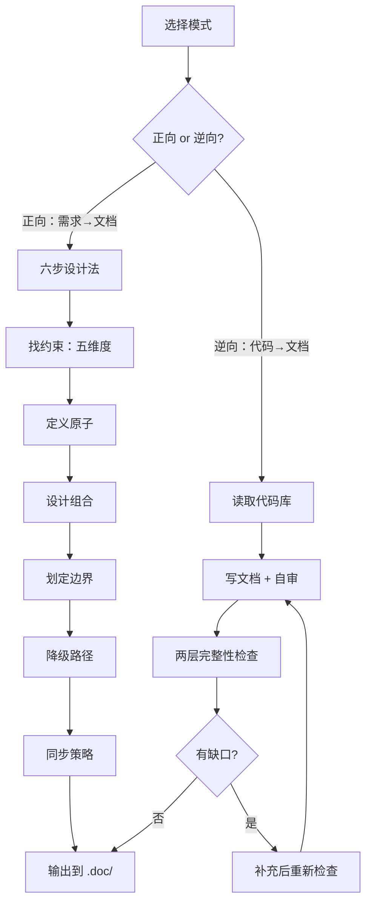
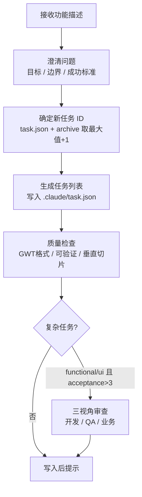
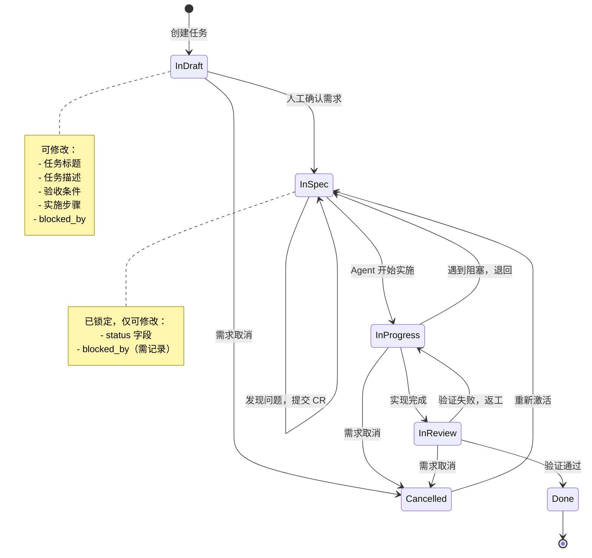
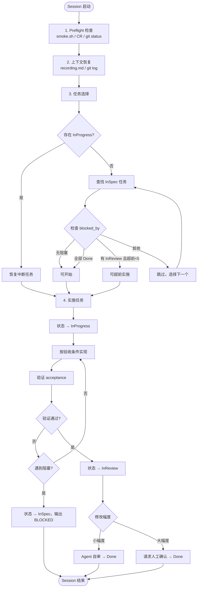

# diwu-workflow

[](https://github.com/ssdiwu/diwu-workflow/stargazers)
[](https://github.com/ssdiwu/diwu-workflow/blob/main/LICENSE)
[](https://github.com/ssdiwu/diwu-workflow)

diwu 编码工作流套件 — Claude Code 插件。让 AI 按照你确认的需求执行开发任务，而不是自行发挥。

---

## 安装

```
/plugin marketplace add ssdiwu/diwu-workflow
/plugin install diwu-workflow@ssdiwu
```

---

## 快速开始

### 新项目

```
/dinit          # 初始化工作流结构（CLAUDE.md / task.json / hooks）
/dprd           # 讨论方案，生成 PRD，识别 Demo 需求
/dadr           # 有架构决策时记录（可选）
/ddoc           # 基于 PRD 正向生成产品文档
/ddemo          # 对每个 Demo 需求生成落地方案
/dtask          # Demo 验证通过后，拆解集成任务列表
```

> 示例：做「消息通知」功能 → `/dprd` 讨论推送方式，确定用 WebSocket 时 `/dadr` 记录决策，方案通过后 `/ddoc` 写产品文档，`/ddemo` 为不确定功能点（如 Prompt 稳定性）生成验证方案，通过后 `/dtask` 拆集成任务。

### 接手老项目

```
/ddoc           # 逆向还原现有代码的产品文档
/dprd           # 基于现有产品讨论新需求
/dadr           # 记录新的架构决策（可选）
/ddoc           # 正向补充新功能文档
/dtask          # 拆解新功能任务
```

---

## 命令参考

| 命令 | 作用 |
|------|------|
| `/dinit` | 初始化项目工作流结构 |
| `/dprd` | 生成产品需求文档（PRD） |
| `/dadr` | 记录架构决策（ADR） |
| `/ddoc` | 产品文档（正向/逆向两种模式） |
| `/ddemo` | 针对单个不确定性功能点，生成完整落地方案 |
| `/dtask` | 将功能描述拆解为任务列表 |

每个命令的约束表说明「必须同时为真的约束集合」——违反任一约束，输出即不可信。

### /dinit

| 维度 | 约束 |
|-----|------|
| 业务 | 已存在的文件不覆盖（幂等）；规则文件写入 `.claude/rules/`，不内联到 CLAUDE.md |
| 时序 | 收集信息 → 创建文件 → 验证清单；不可跳过信息收集直接创建文件 |
| 跨命令 | 创建的 `.claude/task.json` 结构必须与 `/dtask` 写入格式兼容 |
| 感知 | 验证清单全部通过才算完成；缺少任一文件不算初始化成功 |

### /dprd

| 维度 | 约束 |
|-----|------|
| 业务 | Layer 0 未通过时 Layer 1 不得开始；不写 task.json；不生成代码；Demo 需求名称必须用 kebab-case |
| 时序 | 确认定位 → Q1-Q8 逐问（每次只问一个）→ 检查已有 PRD → 生成 → 写入 → 自检；Q 顺序不可颠倒 |
| 跨命令 | PRD README 的 Demo 需求列是 `/ddemo` 的输入；`.doc/README.md` 和 `.doc/adr/README.md` 是 Q5 的前置读取 |
| 感知 | 交付前自检：智能引号 0 命中、绝对路径 0 命中、乱码 0 命中；否则不可交付 |

### /dadr

| 维度 | 约束 |
|-----|------|
| 业务 | 同一决策只有一个 ADR（更新不新建）；Context 必须有具体数字；Consequences 的 ⚠️ 必须有触发条件和解决路径 |
| 时序 | 先读 README 判断新建/更新 → 写文件 → 更新 README；不可先写文件再判断 |
| 跨命令 | ADR README 是 `/dprd` Q5 的输入；ADR 编号格式 `ADR-NNN` 是 `/dtask` steps 引用的依据 |
| 感知 | 备选方案的缺点必须是具体技术风险和触发条件，不允许「复杂度高」等模糊描述 |

### /ddoc

| 维度 | 约束 |
|-----|------|
| 业务 | 代码是锚点，无法确认的内容标注 `[待确认]`，不编造；逆向模式不写 task.json（大范围除外） |
| 时序 | 写文档 → 自审 → gap 分析（两层）→ 补充缺口 → 再次 gap 分析；gap 分析必须在自审之后 |
| 跨命令 | `.doc/README.md` 是所有命令的入口；每次写入文档后必须同步更新 README（通用货币维护义务） |
| 感知 | 有状态实体必须有 stateDiagram；核心业务流程必须有 flowchart；数据实体关系必须有 erDiagram |


```mermaid
flowchart TD
    A[选择模式] --> B{正向 or 逆向?}

    B -->|正向：需求→文档| C[六步设计法]
    C --> C1[找约束：五维度]
    C1 --> C2[定义原子]
    C2 --> C3[设计组合]
    C3 --> C4[划定边界]
    C4 --> C5[降级路径]
    C5 --> C6[同步策略]
    C6 --> Out[输出到 .doc/]

    B -->|逆向：代码→文档| D[读取代码库]
    D --> E[写文档 + 自审]
    E --> F[两层完整性检查]
    F --> G{有缺口?}
    G -->|是| H[补充后重新检查]
    H --> E
    G -->|否| Out
```

### /ddemo

| 维度 | 约束 |
|-----|------|
| 业务 | 每次只处理一个 Demo；两级门控（先判产品类型，再判能力 vs 功能）；核心验证资产篇幅 > 50%；不写生产架构；不写 task.json |
| 时序 | 两级门控 → 读 README（不全量扫描）→ 建立上下文 → 生成 → 写入 → 更新 Demo README |
| 跨命令 | Demo 文件路径格式 `DEMO-{kebab-case-name}-spec.md` 是 `/dtask` 的查找依据；通过标准必须可量化（供 `/dtask` acceptance 引用） |
| 感知 | 核心验证资产必须可直接运行（Prompt 全文 / 测试矩阵 / 测试脚本），不允许伪代码占位 |

### /dtask

| 维度 | 约束 |
|-----|------|
| 业务 | task ID 永不复用（跨 task.json 和 archive）；functional/ui/bugfix 类 acceptance 必须 GWT 格式；steps 必须自包含（绝对路径，无隐式上下文依赖） |
| 时序 | 先确定最大 ID → 澄清问题 → 生成 → 质量检查 → 可选三视角审查 → 写入；ID 确定必须在生成之前 |
| 跨命令 | 写入的 task.json 是工作流引擎（hooks + Session 启动）的输入；blocked_by 引用的 ID 必须存在于 task.json 或 archive |
| 感知 | 质量检查发现问题时必须列出具体问题 + 建议修正，不可静默写入 |


```mermaid
flowchart TD
    A[接收功能描述] --> B[澄清问题<br>目标 / 边界 / 成功标准]
    B --> C[确定新任务 ID<br>task.json + archive 取最大值+1]
    C --> D[生成任务列表<br>写入 .claude/task.json]
    D --> E[质量检查<br>GWT格式 / 可验证 / 垂直切片]
    E --> F{复杂任务?}
    F -->|functional/ui 且 acceptance>3| G[三视角审查<br>开发 / QA / 业务]
    F -->|否| H[写入后提示]
    G --> H
```

---

## 工作流机制

### 任务状态机


```mermaid
stateDiagram-v2
    [*] --> InDraft: 创建任务
    InDraft --> InSpec: 人工确认需求
    InDraft --> Cancelled: 需求取消

    InSpec --> InProgress: Agent 开始实施
    InSpec --> InSpec: 发现问题，提交 CR

    InProgress --> InReview: 实现完成
    InProgress --> InSpec: 遇到阻塞，退回
    InProgress --> Cancelled: 需求取消

    InReview --> Done: 验证通过
    InReview --> InProgress: 验证失败，返工
    InReview --> Cancelled: 需求取消

    Done --> [*]
    Cancelled --> InSpec: 重新激活

    note right of InDraft
        可修改：
        - 任务标题
        - 任务描述
        - 验收条件
        - 实施步骤
        - blocked_by
    end note

    note right of InSpec
        已锁定，仅可修改：
        - status 字段
        - blocked_by（需记录）
    end note
```

| 状态 | 含义 | 谁可以操作 |
|------|------|-----------|
| `InDraft` | 需求草稿中，所有字段均可自由修改 | 人工 + Agent |
| `InSpec` | 需求已确认并锁定，只有 `status` 字段可以修改 | 人工确认后由 Agent 推进 |
| `InProgress` | 实施中，Agent 正在按验收条件编写代码 | Agent |
| `InReview` | 实现完成，等待验证通过 | Agent 自审或人工确认 |
| `Done` | 验证通过，终态 | — |
| `Cancelled` | 已取消；可重新激活为 `InSpec` | 人工 |

**关键约束**：`InDraft` 任务 Agent 不会主动执行，必须由人工确认为 `InSpec` 后才会开始实施。

`acceptance` 格式：功能 / UI / 修复类任务必须用 `Given … When … Then …`，验证前必须逐条通过。

```
"Given 用户已登录 When 点击退出按钮 Then 清除 token 并跳转登录页"
```

### Session 生命周期

每个 session 启动时按固定顺序执行：


```mermaid
flowchart TD
    Start([Session 启动]) --> Preflight[1. Preflight 检查<br>smoke.sh / CR / git status]
    Preflight --> Context[2. 上下文恢复<br>recording.md / git log]
    Context --> SelectTask[3. 任务选择]

    SelectTask --> CheckInProgress{存在 InProgress?}
    CheckInProgress -->|是| ResumeTask[恢复中断任务]
    CheckInProgress -->|否| FindInSpec[查找 InSpec 任务]

    FindInSpec --> CheckBlocked{检查 blocked_by}
    CheckBlocked -->|无阻塞| CanStart[可开始]
    CheckBlocked -->|全部 Done| CanStart
    CheckBlocked -->|有 InReview 且超前<5| CanAdvance[可超前实施]
    CheckBlocked -->|其他| SkipTask[跳过，选择下一个]
    SkipTask --> FindInSpec

    CanStart --> Implement[4. 实施任务]
    CanAdvance --> Implement
    ResumeTask --> Implement

    Implement --> SetInProgress[状态 → InProgress]
    SetInProgress --> CodeImpl[按验收条件实现]
    CodeImpl --> Verify[验证 acceptance]

    Verify --> VerifyOK{验证通过?}
    VerifyOK -->|否| Blocked{遇到阻塞?}
    Blocked -->|是| SetInSpec[状态 → InSpec，输出 BLOCKED]
    Blocked -->|否| CodeImpl

    VerifyOK -->|是| SetInReview[状态 → InReview]
    SetInReview --> CheckScope{修改幅度}
    CheckScope -->|小幅度| AgentReview[Agent 自审 → Done]
    CheckScope -->|大幅度| HumanReview[请求人工确认 → Done]

    AgentReview --> End
    HumanReview --> End
    SetInSpec --> End([Session 结束])
```

**分层记忆**：Session 上下文由两个文件分工维护：

| 文件 | 回答的问题 | 写入时机 |
|------|-----------|---------:|
| `recording.md` | 发生了什么（session 流水、任务进度、下一步） | 每次 session 结束时 |
| `decisions.md` | 为什么这样设计（方案选择、边界定义、设计方向） | 有重大设计决策时 |

**通用货币：README 索引**

命令之间通过 README 索引传递信息，不直接扫描对方的输出文件：

```
.doc/README.md        ← /ddoc 维护，/dprd /ddemo 读取
.doc/prd/README.md    ← /dprd 维护，/ddemo /dtask 读取
.doc/demo/README.md   ← /ddemo 维护，/dtask 读取
.doc/adr/README.md    ← /dadr 维护，/dprd 读取
```

### 异常处理

#### BLOCKED — 环境或依赖问题

当 Agent 遇到以下情况时，停止任务并输出 BLOCKED，等待人工介入：

- 缺少环境配置（API 密钥、数据库连接）
- 外部依赖不可用（第三方服务宕机、需人工授权）
- 验证无法进行（需真实账号、依赖未部署的外部系统）

BLOCKED 时：任务退回 `InSpec`，禁止创建 commit，禁止标记 Done，在 `recording.md` 记录阻塞原因。人工介入后从 `InSpec` 恢复继续。

#### Change Request — 需求本身有问题

执行 `InSpec` 任务时发现验收条件无法实现或存在矛盾，Agent 提交 Change Request：任务保持 `InSpec`，输出 CR 说明（原因、建议修改、影响评估），等待人工批准后更新 acceptance 继续实施。

#### 超前实施 — 前置任务还在 InReview

前置任务处于 `InReview` 时，Agent 可超前执行后续任务（最多 5 个），超前任务完成时标记 `InReview` 并立即 commit。超前 5 个后暂停等待验收。

前置任务验收失败时，人工决定回退方式：

| 方式 | 适用场景 |
|------|---------|
| `revert` | 超前任务已 push 到远端，需撤销公开提交 |
| `reset --soft` | 超前任务只在本地，保留代码改动但撤销 commit |
| `修改` | 超前任务代码仍有效，只需调整以适配阻塞任务的新实现 |

### 规则可执行性

规则文件按「可执行性三层结构」组织：

- **程序性规则**（固定步骤、状态机）：用列表定义，靠结构保证执行
- **判断性规则**（分类、取舍、边界判定）：必须附正例 / 反例 / 边界例锚点，靠示例保证执行
- **边界**：「谁的问题谁解决」，不跨层污染

规则文件区分约束强度：**无标注 = 强制约束**，`[建议]` = 软约束（可偏离但需记录）。

关键判断节点（任务选择、CR/BLOCKED 判定、大幅度修改判定等）统一输出 `DECISION TRACE`：

```
DECISION TRACE
结论: [BLOCKED | CHANGE REQUEST | CONTINUE | REVIEW | SKIP]
规则命中: [命中的规则条目]
证据: [task.json 状态 / 测试日志 / git diff --stat]
排除项: [为什么不是其他结论]
下一步: [立即执行的动作]
```

---

## 内置 Agents

### 插件级（所有使用插件的项目可用）

| Agent | 专长 |
|-------|------|
| `ui-designer` | UI/UX 设计架构，组件系统、设计决策 |
| `backend-architect` | 后端架构，API 设计、数据模型、性能 |
| `frontend-architect` | 前端架构，状态管理、构建优化 |
| `api-tester` | API 测试，多语言（Python / JS / Go / Clojure） |
| `devops-architect` | DevOps，CI/CD、容器化、基础设施 |
| `performance-optimizer` | 性能优化，瓶颈分析、缓存策略 |
| `legal-compliance` | 法律合规，隐私框架（GDPR/CCPA）、服务条款、知识产权、消费者保护 |

### 项目级（/dinit 初始化时创建到 `.claude/agents/`）

| Agent | permissionMode | maxTurns | 用途 |
|-------|---------------|----------|------|
| `explorer` | plan（只读） | 20 | 代码库调查、架构分析、文件搜索、技术调研 |
| `implementer` | acceptEdits（自动接受编辑） | 100 | 代码修改、功能实现、bug 修复、重构执行 |

---

## Hooks

所有 hook 逻辑已外部化到 `hooks/scripts/*.py`，hooks.json 仅引用外部脚本。

| Hook | 触发时机 | 脚本 | 作用 |
|------|---------|------|------|
| `UserPromptSubmit` | 用户发送消息前 | `user_prompt_submit.py` | 将规则摘要 + lessons + constraints 注入上下文 |
| `SessionStart` | session 启动时 | `session_start.py` | 写主代理 session ID；读取 `.claude/env` 注入环境变量 |
| `PreToolUse` (Bash) | 执行 Bash 前 | `pre_tool_use_bash.py` | 输出 InProgress 任务的 acceptance，防止目标漂移 |
| `SubagentStart` | 子代理启动时 | `subagent_start.py` | 自动注入 recording.md 摘要 + InProgress 任务 + 最近决策到子代理上下文 |
| `SubagentStop` | 子代理完成时 | `subagent_stop.py` | 读取 `last_assistant_message` 自动记录子代理产出摘要到 recording.md |
| `PreCompact` | 对话压缩前 | `pre_compact.py` | 自动保存 InProgress 任务进度快照（git diff --stat）到 recording.md |
| `PostToolUse` (Write/Edit) | 写入文件后 | `post_tool_json_validate.py` | 自动校验 .json 文件格式，发现错误立即反馈 |
| `Stop` (background) | 回合结束（后台） | `stop_background.py` | 输出 git status 文件变更快照 |
| `Stop` (blocking) | 回合结束（前台） | `stop_blocking.py` | review buffer 机制 + 任务循环（从 settings.json 读取配置） |

---

## 设计理念

AI 擅长执行，不擅长决策。diwu-workflow 的核心主张是：**人负责决策，AI 负责操作**。所有需要判断的决策节点由人把关，Agent 只负责把确认过的事情做完、做对——它不能在需求草稿时开始写代码，不能在验证没过时提交 commit，也不能在遇到阻塞时假装完成。

工作流基于四个规范驱动开发的实践：

- **BDD**（行为驱动）：所有任务的验收条件用 Given/When/Then 格式写死，Agent 按此实现，不得自行解释需求
- **TDD**（测试驱动）：验证先于完成——未通过验收条件的任务不允许标记 Done，不允许提交 commit
- **SDD**（规范驱动）：产品文档（`/ddoc`）和架构决策（`/dadr`）在实施前落地，代码跟着规范走，不是规范跟着代码补
- **DDD**（领域驱动）：`/ddoc` 按功能域组织文档（`auth.md` / `billing.md` / …），每个任务只需加载对应域的文档，而不是整个代码库

在此之上，用**强约束状态机**控制任务流转：

```
InDraft（草稿）→ InSpec（已锁定）→ InProgress（实施中）→ InReview（待验证）→ Done（完成）
```

状态机的核心约束是：系统在任意时刻只能处于一个明确的状态，且只有满足特定条件才能转移，所有不合法的转移直接被忽略。每个状态的边界由规则定义，不依赖 AI 的自我约束。

---

## 仓库结构

```
diwu-workflow/
├── .claude-plugin/
│   ├── plugin.json          # 插件描述
│   ├── marketplace.json     # 市场索引
│   └── agents/              # 内置专家 agents（7 个）
│       ├── ui-designer.md
│       ├── backend-architect.md
│       └── ...
├── commands/                # 用户主动触发的命令（/dinit 等）
│   ├── dinit.md
│   ├── dprd.md
│   ├── dadr.md
│   ├── ddoc.md
│   ├── ddemo.md
│   └── dtask.md
├── skills/                  # Claude 自动加载的背景知识
│   ├── ddoc/
│   │   └── SKILL.md         # /ddoc 框架知识（正向六步法 + 逆向还原）
│   ├── diwu-prd/
│   │   └── SKILL.md         # PRD 方法论（竞品分析、用户画像、非功能性需求）
│   └── diwu-demo/
│       └── SKILL.md         # 积木式能力验证方法论（不确定性判断、三层积木模型）
├── assets/
│   ├── rules/
│   │   └── rules-index.md   # UserPromptSubmit hook 注入的规则摘要
│   └── dinit/               # /dinit 依赖的模板与规则
│       ├── assets/
│       │   ├── *.template   # CLAUDE.md / task.json / settings.json 等模板
│       │   ├── agents/      # 项目级 agents 模板（explorer / implementer）
│       │   ├── env.example   # 环境变量示例文件
│       │   └── rules/       # core-states / core-workflow 等规则文件（完整版）
│       ├── references/      # 参考资料
│       └── sync-rules.sh    # 同步规则文件到 assets/dinit/assets/rules/
├── hooks/
│   ├── hooks.json           # hook 配置（引用 scripts/ 下的外部脚本）
│   └── scripts/             # hook 脚本（9 个独立 .py 文件）
│       ├── user_prompt_submit.py
│       ├── session_start.py
│       ├── pre_tool_use_bash.py
│       ├── subagent_start.py
│       ├── subagent_stop.py
│       ├── pre_compact.py
│       ├── post_tool_json_validate.py
│       ├── stop_background.py
│       └── stop_blocking.py
├── init.sh                  # 本仓库开发环境初始化
└── AGENTS.md                # 多 agent 协作配置（gitignore）
```

---

## License

MIT
