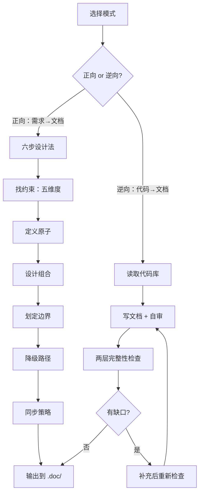
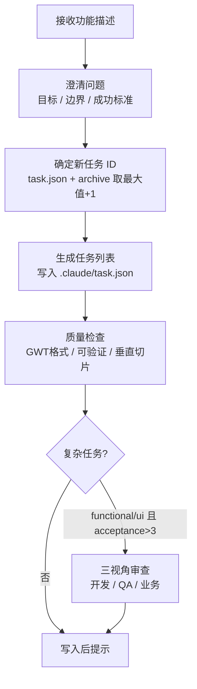
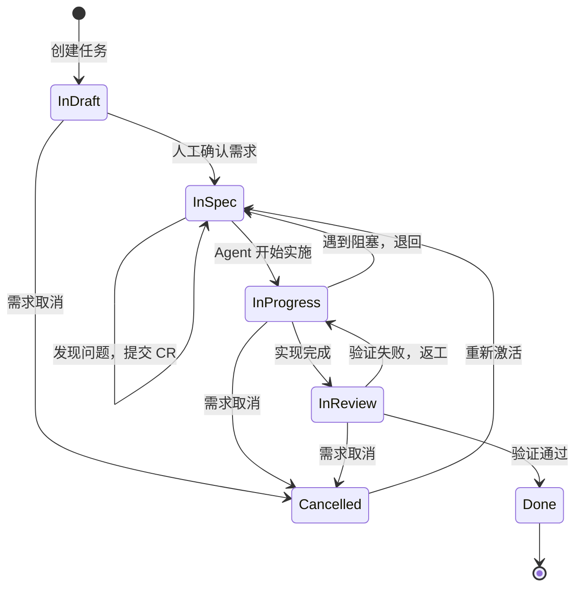
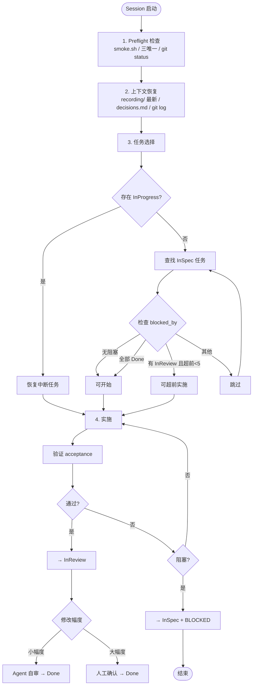

# diwu-workflow

[](https://github.com/ssdiwu/diwu-workflow/stargazers)
[](https://github.com/ssdiwu/diwu-workflow/blob/main/LICENSE)
[](https://github.com/ssdiwu/diwu-workflow)

diwu 编码工作流套件 — Claude Code 插件（v0.10.0）。让 AI 按确认的需求执行开发任务，而非自行发挥。

---

## 安装

```
/plugin marketplace add ssdiwu/diwu-workflow
/plugin install diwu-workflow@ssdiwu
```

---

## 快速开始

### 新项目

```
/dinit          # 初始化工作流结构（CLAUDE.md / task.json / hooks / rules / agents）
/dprd           # 讨论方案，生成 PRD，识别 Demo 需求
/dadr           # 有架构决策时记录（可选）
/ddoc           # 基于 PRD 正向生成产品文档
/ddemo          # 对每个 Demo 需求生成落地方案
/dtask          # Demo 验证通过后，拆解集成任务列表
```

> 示例：做「消息通知」功能 → `/dprd` 讨论推送方式 → 确定用 WebSocket 时 `/dadr` 记录决策 → `/ddoc` 写产品文档 → `/ddemo` 为不确定功能点生成验证方案 → `/dtask` 拆集成任务。

### 接手老项目

```
/ddoc           # 逆向还原现有代码的产品文档
/dprd           # 基于现有产品讨论新需求
/dadr           # 记录新的架构决策（可选）
/ddoc           # 正向补充新功能文档
/dtask          # 拆解新功能任务
```

---

## 命令参考（7 个）

| 命令 | 一句话 | 详细说明 |
|------|--------|---------|
| `/dinit` | 初始化工作流结构 | v2 精简 CLAUDE.md + rules + agents + 迁移检测 |
| `/dprd` | 生成产品需求文档（PRD） | 竞品分析、用户画像、需求优先级、非功能性需求 |
| `/dadr` | 记录架构决策（ADR） | 输出到 `.doc/adr/`，支持新建与更新 |
| `/ddoc` | 产品文档工具 | 正向（需求→文档）或逆向（代码→文档）两种模式 |
| `/ddemo` | 不确定性功能点验证 | 将不确定性隔离为可复用的能力验证单元 |
| `/dtask` | 任务管理 | 功能描述→task.json 任务列表，含 GWT acceptance |
| `/dcorr` | 纠偏恢复协议 | 四行重写 → 误判排查 → 重判门控 → 恢复骨架 |

每个命令的约束表说明「必须同时为真的约束集合」——违反任一约束，输出即不可信。

### /dinit

| 维度 | 约束 |
|-----|------|
| 业务 | 已存在的文件不覆盖（幂等）；规则写入 `.claude/rules/`，不内联到 CLAUDE.md |
| 时序 | 收集信息 → 创建文件 → 验证清单；不可跳过信息收集直接创建文件 |
| 跨命令 | 创建的 `.claude/task.json` 结构必须与 `/dtask` 写入格式兼容 |
| 感知 | 验证清单全部通过才算完成；缺少任一文件不算初始化成功 |

### /dprd

| 维度 | 约束 |
|-----|------|
| 业务 | Layer 0 未通过时 Layer 1 不得开始；不写 task.json；不生成代码；Demo 需求名称必须 kebab-case |
| 时序 | 确认定位 → Q1-Q8 逐问（每次只问一个）→ 检查已有 PRD → **脊梁提炼（用户确认）→ 论证链设计（用户确认）→ 积木选取 → 反模式门禁** → 写入 → 自检 |
| 跨命令 | PRD README 的 Demo 需求列是 `/ddemo` 的输入；`.doc/README.md` 和 `.doc/adr/README.md` 是 Q5 的前置读取 |
| 感知 | 交付前自检：智能引号 0 命中、绝对路径 0 命中、乱码 0 命中；否则不可交付 |

### /dadr

| 维度 | 约束 |
|-----|------|
| 业务 | 同一决策只有一个 ADR（更新不新建）；Context 必须有具体数字；Consequences 的 ⚠️ 必须有触发条件和解决路径 |
| 时序 | 先读 README 判断新建/更新 → 写文件 → 更新 README；不可先写文件再判断 |
| 跨命令 | ADR README 是 `/dprd` Q5 的输入；ADR 编号格式 `ADR-NNN` 是 `/dtask` steps 引用的依据 |
| 感知 | 备选方案的缺点必须是具体技术风险和触发条件，不允许「复杂度高」等模糊描述 |

### /ddoc

| 维度 | 约束 |
|-----|------|
| 业务 | 代码是锚点，无法确认的内容标注 `[待确认]`，不编造；逆向模式不写 task.json（大范围除外） |
| 时序 | 写文档 → 自审 → gap 分析（两层）→ 补充缺口 → 再次 gap 分析；gap 分析必须在自审之后 |
| 跨命令 | `.doc/README.md` 是所有命令的入口；每次写入文档后必须同步更新 README（通用货币维护义务） |
| 感知 | 有状态实体必须有 stateDiagram；核心业务流程必须有 flowchart；数据实体关系必须有 erDiagram |


```mermaid
flowchart TD
    A[选择模式] --> B{正向 or 逆向?}

    B -->|正向：需求→文档| C[六步设计法]
    C --> C1[找约束：五维度]
    C1 --> C2[定义原子]
    C2 --> C3[设计组合]
    C3 --> C4[划定边界]
    C4 --> C5[降级路径]
    C5 --> C6[同步策略]
    C6 --> Out[输出到 .doc/]

    B -->|逆向：代码→文档| D[读取代码库]
    D --> E[写文档 + 自审]
    E --> F[两层完整性检查]
    F --> G{有缺口?}
    G -->|是| H[补充后重新检查]
    H --> E
    G -->|否| Out
```

### /ddemo

| 维度 | 约束 |
|-----|------|
| 业务 | 每次只处理一个 Demo；两级门控（先判产品类型，再判能力 vs 功能）；核心验证资产篇幅 > 50%；不写生产架构；不写 task.json |
| 时序 | 两级门控 → 读 README（不全量扫描）→ 建立上下文 → 生成 → 写入 → 更新 Demo README |
| 跨命令 | Demo 文件路径格式 `DEMO-{kebab-case-name}-spec.md` 是 `/dtask` 的查找依据；通过标准必须可量化（供 `/dtask` acceptance 引用） |
| 感知 | 核心验证资产必须可直接运行（Prompt 全文 / 测试矩阵 / 测试脚本），不允许伪代码占位 |

### /dtask

| 维度 | 约束 |
|-----|------|
| 业务 | task ID 永不复用（跨 task.json 和 archive）；functional/ui/bugfix 类 acceptance 必须 GWT 格式；steps 必须自包含（绝对路径，无隐式上下文依赖） |
| 时序 | 先确定最大 ID → 澄清问题 → 生成 → 质量检查 → 可选三视角审查 → 写入；ID 确定必须在生成之前 |
| 跨命令 | 写入的 task.json 是工作流引擎（hooks + Session 启动）的输入；blocked_by 引用的 ID 必须存在于 task.json 或 archive |
| 感知 | 质量检查发现问题时必须列出具体问题 + 建议修正，不可静默写入 |


```mermaid
flowchart TD
    A[接收功能描述] --> B[澄清问题<br>目标 / 边界 / 成功标准]
    B --> C[确定新任务 ID<br>task.json + archive 取最大值+1]
    C --> D[生成任务列表<br>写入 .claude/task.json]
    D --> E[质量检查<br>GWT格式 / 可验证 / 垂直切片]
    E --> F{复杂任务?}
    F -->|functional/ui 且 acceptance>3| G[三视角审查<br>开发 / QA / 业务]
    F -->|否| H[写入后提示]
    G --> H
```

### /dcorr

| 维度 | 约束 |
|-----|------|
| 业务 | 不改变 task.json 状态（纠偏是过程修正，不是状态转移）；不退化成全程运行总规范或禁止清单 |
| 时序 | 触发检测 → 停止 6 类动作 → 四行重写 → 误判排查（6 类泛化模式）→ 入口重判（A/B/C 三门控）→ 恢复执行骨架 → 结束前四问 |
| 跨命令 | 与 InProgress 任务共存时不改变状态，仅记录到 session 文件；恢复失败按止损序列处理（切上下文 → 缩任务 → 写缺口 → 请求人工） |
| 感知 | 恢复后第一条输出禁止宣称"已完成"；判断必须有依据（正例/反例/现象/数据）；验证优先级 L1-L3 主判，L5 不可宣称完成 |

**触发条件**（满足任一即启动）：

| # | 退化信号 |
|---|---------|
| 1 | 同一问题已被纠偏两次以上仍沿旧路径推进 |
| 2 | 同一前提被反复解释 |
| 3 | 输出越来越像通用套路，越来越不像当前任务 |
| 4 | 讨论越来越长，下一步动作越来越模糊 |
| 5 | 已改动却拿不出运行态或输出层证据 |
| 6 | 开始同时引用多个目录、多个入口、多个"真相源" |

---

## 规则体系（v2.0：渐进式披露架构）

> 核心变化：从旧版全量注入 ~1500 行重构为 v2 架构：「~80 行基线 CLAUDE.md + 9 个按需加载 Skill + 4 个参考文件」。

**三层加载策略**：

| 层级 | 内容 | 加载方式 |
|------|------|---------|
| **核心不变量**（~80 行） | 三唯一框架、P-J-A 骨架、不确定性门控、证据优先级摘要 | 内嵌 CLAUDE.md，每次 session 自动加载 |
| **Skill**（9 个） | 各领域详细知识与操作规范 | Agent 遇到对应场景时通过 `/skill-name` 或 `Read` 按需加载 |
| **参考文件**（4 个） | 异常处理、格式模板、目录结构、架构约束 | Read on demand |

### 9 个 Skill 总览

| Skill | 类型 | 触发场景 | 来源规则文件 |
|-------|------|---------|-------------|
| `dtask` | 规则 | 任务管理、状态机、GWT acceptance、提交规范 | task.md + workflow.md |
| `dsess` | 规则 | Session 生命周期、任务选择、continuous_mode | session.md |
| `dcorr` | 规则 | 退化信号检测、四行重写、误判排查、纠偏恢复 | correction.md + pitfalls.md |
| `dverify` | 规则 | L1-L5 证据优先级、Done 判定、验证充分性 | verification.md |
| `djudge` | 规则 | 阶段边界决策、幅度判定、并行 vs 串行 | judgments.md |
| `drecord` | 规则 | Session 记录格式、踩坑经验、时间戳规则 | session.md(recording段) + templates.md |
| `ddoc` | 工具 | 正向/逆向生成产品文档 | 原有 |
| `dprd` | 工具 | PRD 方法论（竞品分析、用户画像、需求优先级） | 原有 |
| `ddemo` | 工具 | 不确定性功能点验证方案（积木式能力验证） | 原有 |

### 参考文件（Read on demand）

| 文件 | 用途 |
|------|------|
| `rules/exceptions.md` | 异常处理与 BLOCKED 判定 |
| `rules/templates.md` | 格式模板与可调参数 |
| `rules/file-layout.md` | 目录结构与归档规则 |
| `rules/constraints.md` | 五维约束设计方法论 |

### 可调参数（dsettings.json）

由 `/dinit` 初始化到 `.claude/dsettings.json`，用户可按项目调整。

| 参数 | 默认值 | 说明 |
|------|--------|------|
| `review_limit` | 5 | 超前实施上限（同时 InReview 的任务数） |
| `task_archive_threshold` | 20 | Done/Cancelled 超此数触发 task 归档 |
| `recording_archive_threshold` | 50 | session 文件超此数触发 recording 归档 |
| `recording_retention_days` | 30 | 归档时保留最近 N 天的 session 文件 |
| `snapshot_dedup_sec` | 600 | 快照去重时间窗口秒数（stop_background.py 读） |
| `context_monitor_warning` | 30 | WARNING 阈值：工具调用次数 |
| `context_monitor_critical` | 50 | CRITICAL 阈值：触发阻塞提醒 |
| `context_monitor_delay` | 10 | CRITICAL+DELAY 延迟阈值 |
| `continuous_mode` | `true` | 持续运行模式开关（stop_decision.py 读） |
| `drift_detection.enabled` | `true` | 退化检测开关 |
| `subagent_concurrency` | 3 | 子代理最大并行数（subagent_start.py 读） |
| `subagent_explore_model` | `haiku` | 探索类子代理模型（subagent_start.py 读） |
| `subagent_implement_model` | `inherit` | 实施类子代理模型（subagent_start.py 读） |
| `pitfalls.archive_aggregate` | `true` | 归档时聚合踩坑到 pitfalls（stop_archive_agg.py 读） |
| `error_injection.enabled` | `true` | PreToolUse 错误/决策注入开关 |
| `error_injection.max_sessions` | 3 | 注入时扫描的最近 session 数量 |
| `error_tracking.enabled` | `true` | PostToolUseFailure 3-Strike 协议开关 |
| `recording_reminder.enabled` | `true` | PostToolUse 写后记录提醒开关 |

### Hook 注入策略（两级模式）

| 层级 | 行为 | 触发条件 |
|------|------|---------|
| **Tier1 轻量指针** | 始终输出 ~100 字符的 Skill 索引和指向提醒 | 每次 session / 工具调用 |
| **Tier2 条件注入** | 仅在满足条件时注入完整内容（踩坑历史、决策记录等） | 同工具失败≥2次 / 检测到退化 / 新 session |

**规则可执行性三层**：

- **程序性规则**（固定步骤、状态机）：用列表定义，靠结构保证执行
- **判断性规则**（分类、取舍、边界判定）：必须附正例 / 反例 / 边界例锚点，靠示例保证执行
- **边界**：「谁的问题谁解决」，不跨层污染

约束强度：**无标注 = 强制约束**，`[建议]` = 软约束（可偏离但需记录）。

---

## 工作流核心

### 任务状态机


```mermaid
stateDiagram-v2
    [*] --> InDraft: 创建任务
    InDraft --> InSpec: 人工确认需求
    InDraft --> Cancelled: 需求取消

    InSpec --> InProgress: Agent 开始实施
    InSpec --> InSpec: 发现问题，提交 CR

    InProgress --> InReview: 实现完成
    InProgress --> InSpec: 遇到阻塞，退回
    InProgress --> Cancelled: 需求取消

    InReview --> Done: 验证通过
    InReview --> InProgress: 验证失败，返工
    InReview --> Cancelled: 需求取消

    Done --> [*]
    Cancelled --> InSpec: 重新激活
```

| 状态 | 含义 | 操作权限 |
|------|------|---------|
| `InDraft` | 需求草稿中，所有字段可自由修改 | 人工 + Agent |
| `InSpec` | 需求已确认锁定，仅可修改 `status` | 人工确认后由 Agent 推进 |
| `InProgress` | 实施中 | Agent |
| `InReview` | 实现完成，等待验证 | Agent 自审或人工确认 |
| `Done` | 验证通过（终态） | — |
| `Cancelled` | 已取消；可重新激活为 `InSpec` | 人工 |

**关键约束**：`InDraft` 任务 Agent 不会主动执行，必须由人工确认为 `InSpec` 后才开始实施。

`acceptance` 格式：功能/UI/修复类任务必须用 `Given … When … Then …`：

```
"Given 用户已登录 When 点击退出按钮 Then 清除 token 并跳转登录页"
```

### Session 生命周期

每个 session 启动时按固定顺序执行：


```mermaid
flowchart TD
    Start([Session 启动]) --> Preflight[1. Preflight 检查<br>smoke.sh / 三唯一 / git status]
    Preflight --> Context[2. 上下文恢复<br>recording/ 最新 / decisions.md / git log]
    Context --> SelectTask[3. 任务选择]

    SelectTask --> CheckInProgress{存在 InProgress?}
    CheckInProgress -->|是| ResumeTask[恢复中断任务]
    CheckInProgress -->|否| FindInSpec[查找 InSpec 任务]

    FindInSpec --> CheckBlocked{检查 blocked_by}
    CheckBlocked -->|无阻塞| CanStart[可开始]
    CheckBlocked -->|全部 Done| CanStart
    CheckBlocked -->|有 InReview 且超前<5| CanAdvance[可超前实施]
    CheckBlocked -->|其他| SkipTask[跳过]
    SkipTask --> FindInSpec

    CanStart --> Implement[4. 实施]
    CanAdvance --> Implement
    ResumeTask --> Implement

    Implement --> Verify[验证 acceptance]
    Verify --> VerifyOK{通过?}
    VerifyOK -->|是| SetInReview[→ InReview]
    VerifyOK -->|否| Blocked{阻塞?}
    Blocked -->|是| SetInSpec[→ InSpec + BLOCKED]
    Blocked -->|否| Implement

    SetInReview --> CheckScope{修改幅度}
    CheckScope -->|小幅度| Done[Agent 自审 → Done]
    CheckScope -->|大幅度| Review[人工确认 → Done]
    SetInSpec --> End([结束])
```

**分层记忆**：

| 文件 | 回答的问题 | 写入时机 |
|------|-----------|---------:|
| `recording/` | 发生了什么（session 流水、进度、下一步），每个 session 一个独立文件 | 每次 session 结束时 |
| `decisions.md` | 为什么这样设计（方案选择、边界定义） | 有重大设计决策时 |

**归档机制**：

- **task.json 归档**：Done/Cancelled 超过阈值（默认 20）→ `archive/task_archive_YYYY-MM.json`
- **recording/ 归档**：session 文件超阈值（默认 50）→ 保留最近 30 天，其余打包

阈值可在 `.claude/dsettings.json` 配置。

### 异常处理

#### BLOCKED — 环境或依赖问题

Agent 遇到以下情况停止任务并等待人工介入：缺少环境配置、外部依赖不可用、验证无法进行。

BLOCKED 时：任务退回 `InSpec`，禁止 commit，禁止标记 Done，记录阻塞原因到 `recording/`。

#### Change Request — 需求矛盾

`InSpec` 任务验收条件无法实现或存在矛盾时，Agent 提交 CR：保持 `InSpec`，输出原因+建议+影响评估，等待人工批准。

#### 超前实施

前置任务 `InReview` 时可超前执行后续任务（最多 5 个），完成后立即 commit。达上限后暂停验收。

### 思维框架：现象→判断→动作

所有规则都是这条链的具体实例。违反此链的规则是空壳，缺少此链的工作是空转。

| 环节 | 含义 | 常见缺失 |
|------|------|---------|
| **现象** | 看到了什么（事实、数据、异常） | 抽象描述代替具体观察 |
| **判断** | 得出什么结论（依据什么） | 跳步到动作，或缺少依据 |
| **动作** | 接下来做什么（具体行动） | 停在理解层，不推动执行 |

关键判断节点统一输出 `DECISION TRACE`：

```
DECISION TRACE
结论: [BLOCKED | CHANGE REQUEST | CONTINUE | REVIEW | SKIP]
规则命中: [命中的规则条目]
证据: [事实数据]                    ← 现象
排除项: [为什么不是其他结论]        ← 判断
下一步: [立即执行的动作]            ← 动作
```

---

## Agents（10 个）

### 分层总览

| 层级 | 数量 | 定位 | 触发方式 |
|------|------|------|---------|
| **核心层** | 3 | 工作流闭环角色：探索、实施、验收 | 自动委派 / 主代理调度 |
| **领域层** | 7 | 按需专家顾问，处理特定技术领域 | 自然语言 / @mention |

| 层级 | 存放位置 | 说明 |
|------|---------|------|
| **项目级**（核心层） | `.claude/agents/` | explorer / implementer / verifier，随项目上下文工作 |
| **插件级**（领域层） | `agents/` | 7 个领域专家，由插件提供通用顾问能力 |

### 核心 Agent（3 个）

| Agent | 权限 | 最大轮次 | 定位 |
|-------|------|---------|------|
| `explorer` | plan（只读） | 20 | 只读探索代码库，保护主对话上下文不被污染 |
| `implementer` | acceptEdits | 100 | 核心层唯一写权限角色：代码修改、功能实现、bug 修复 |
| `verifier` | plan（只读） | 30 | 独立验收：从 acceptance 反推可观测事实，防止"自说自话" |

**verifier 工作流**：提取 GWT acceptance → 反推可观测事实 → 独立验证（文件级→脚本级→请求级）→ Stub Pattern 扫描 → 三档报告（PASSED / GAPS_FOUND / HUMAN_NEEDED）

**verifier 铁律**：不读 recording/、不信任 implementer 自述、不假设"改了=做了"、遇不确定输出 HUMAN_NEEDED。

### 领域 Agent（7 个）

| Agent | 触发时机 | 典型场景 |
|-------|---------|---------|
| `ui-designer` | UI/UX 设计决策 | 组件设计系统、无障碍合规、CSS/布局诊断 |
| `backend-architect` | 服务端架构 | API 设计、数据库 schema、服务拆分、缓存策略 |
| `frontend-architect` | 前端架构 | 状态管理选型、组件架构、构建优化、bundle 分析 |
| `api-tester` | 测试策略 | 契约测试、边界用例、多语言测试框架 |
| `devops-architect` | 运维部署 | CI/CD 流水线、容器化、基础设施即代码、监控告警 |
| `performance-optimizer` | 性能问题 | 瓶颈分析、前端加载优化、数据库查询优化 |
| `legal-compliance` | 法规要求 | 隐私政策（GDPR/CCPA）、数据处理合规、知识产权 |

> 领域 Agent 通过自然语言描述或 `@agent-name` 触发，不参与自动任务流转。独立开发者的「专家咨询台」。

### 选择指南

```
问题类型判断：
├─ 代码修改/实现？     → implementer（核心层）
├─ 代码库探索/调查？   → explorer（核心层）
├─ 任务完成后的验收？ → verifier（核心层）
├─ UI/UX 相关？        → ui-designer（领域层）
├─ 后端/API/数据库？   → backend-architect（领域层）
├─ 前端/状态管理/构建？→ frontend-architect（领域层）
├─ 测试策略/契约测试？ → api-tester（领域层）
├─ CI/CD/部署/运维？   → devops-architect（领域层）
├─ 性能优化？          → performance-optimizer（领域层）
└─ 法律/合规/隐私？    → legal-compliance（领域层）
```

---

## Hooks

所有 hook 逻辑已外部化到 `hooks/scripts/*.py`，hooks.json 仅引用外部脚本。

| Hook | 触发时机 | 核心作用 |
|------|---------|---------|
| `UserPromptSubmit` | 用户发送消息前 | 核心不变量精简提取 + Skill 索引指向（Tier1） |
| `SessionStart` | Session 启动时 | 写 session ID；注入环境变量 |
| `PreToolUse` | 大部分工具调用前 | 退化信号检测 + 任务提醒 + 两级注入（Tier1/Tier2） |
| `SubagentStart` | 子代理启动时 | 注入 session 摘要 + InProgress 任务 + Skill 索引 |
| `SubagentStop` | 子代理完成时 | 自动记录子代理产出摘要到 recording/ |
| `PreCompact` | 对话压缩前 | 保存 InProgress 任务进度快照到 recording/ |
| `PostToolUse` (Write/Edit) | 写入文件后 | JSON 格式校验 + 记录提醒（含失败检测） |
| `PostToolUse` (通用) | 每次工具调用后 | Context Rot 监控（WARNING@30 / CRITICAL@50）+ 只读连击检测 |
| `Stop` (background) | 回合结束（后台） | git diff --stat 变更快照（session 窗口内去重） |
| `Stop` (blocking) | 回合结束（前台） | **调度器**：依次调用完整性检查 → 归档聚合 → continuous_mode 决策 |
| `stop_integrity` | Stop 子模块 | Session 格式校验（踩坑字段正则 + 时间戳合法性） |
| `stop_archive_agg` | Stop 子模块 | 归档时扫描 recording 踩坑 → 聚合写入 project-pitfalls |
| `stop_decision` | Stop 子模块 | continuous_mode 决策树 + checkpoint 写入 + OS 通知 |
| `stop_snapshot` | Stop 子模块（后台） | InProgress 任务 git diff --stat 快照（去重写入） |
| `PostToolUseFailure` | 工具执行失败时 | 3-Strike 错误协议（诊断→换方法→停手重想） |
| `TaskCompleted` | 任务完成时 | 确认 recording 已写入 + decisions 已更新 |

---

## 设计理念

AI 擅长执行，不擅长决策。**人负责决策，AI 负责操作**。

基于四个规范驱动开发实践：

- **BDD**（行为驱动）：验收条件用 Given/When/Then 写死，Agent 按此实现
- **TDD**（测试驱动）：未通过验收不允许标记 Done，不允许提交 commit
- **SDD**（规范驱动）：产品文档和架构决策在实施前落地，代码跟着规范走
- **DDD**（领域驱动）：文档按功能域组织，每个任务只加载对应域文档

在此之上，用**强约束状态机**控制流转：

```
InDraft → InSpec → InProgress → InReview → Done
```

任意时刻只能处于一个明确的状态，只有满足特定条件才能转移，所有不合法转移直接被忽略。状态边界由规则定义，不依赖 AI 自我约束。

---

## 仓库结构

```
diwu-workflow/
├── .claude-plugin/              # 插件元数据（plugin.json + marketplace.json）
├── commands/                    # 7 个用户命令
│   ├── dinit.md                 # 初始化工作流结构
│   ├── dprd.md                  # 产品需求文档（PRD）
│   ├── dadr.md                  # 架构决策记录（ADR）
│   ├── ddoc.md                  # 产品文档（正向/逆向）
│   ├── ddemo.md                 # 不确定性功能点验证
│   ├── dtask.md                 # 任务管理
│   └── dcorr.md                 # 纠偏恢复协议
├── skills/                      # 9 个 Skill（按需加载）
│   ├── ddoc / dprd / ddemo      # 3 个工具类 Skill
│   └── dtask / dsess / dcorr / dverify / djudge / drecord  # 6 个规则类 Skill
├── agents/                      # 7 个插件级领域 Agent
├── .claude/agents/              # 3 个项目级核心 Agent（/dinit 初始化时创建）
├── .agents/skills/              # Skill 快捷入口（symlink → skills/，供 AI IDE 发现）
├── hooks/                       # Hook 配置 + 脚本（20+ .py）
└── assets/dinit/                # /dinit 模板资源（模板 + 规则源文件 + agent 模板）
```

---

## License

MIT
