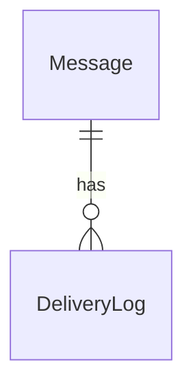
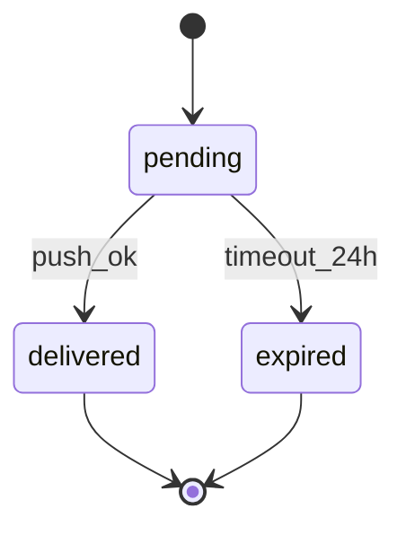
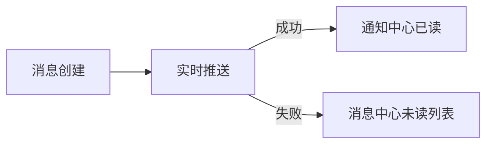

# /ddoc — 产品文档

## Step 1：确认模式与范围

询问用户（上下文已明确的跳过）：
1. **模式**：正向（有需求，要写文档）还是逆向（有代码，要还原文档）？
2. **范围**：整个产品 / 特定模块 / 特定功能？
3. **输入**：代码库路径（逆向）或需求描述（正向）
4. **输出结构**：领域驱动（推荐，有 3 个以上业务域时）还是分层（工具类产品或小项目）？

## Step 1.5：四层最小完整示范（先看成品粒度）

以下示范用于锚定输出深度。不是模板空格，而是可直接参照的分析粒度：

````markdown
# 消息通知域（最小完整示范）

## 1. 数据层

### 实体

| 实体 | 字段 | 约束 |
|------|------|------|
| Message | id, user_id, content, status, created_at, expire_at | status ∈ {pending, delivered, expired}；id 全局唯一 |
| DeliveryLog | id, message_id, channel, delivered_at, result | message_id 外键；result ∈ {ok, fail} |



## 2. 接口层

| 端点 | 入参 | 出参 | 错误码 |
|------|------|------|-------|
| `POST /api/messages` | `{userId, content}` | `{messageId, status}` | `400` 参数错误，`503` DB 不可用 |
| `GET /api/messages/unread` | `userId` | `[{id, content, createdAt}]` | `401` 未登录 |

## 3. 业务逻辑层

- 规则1：同一条消息只能成功投递一次（幂等）
- 规则2：`pending` 消息在用户下次登录 24h 内可重投，超时转 `expired`
- 异常：推送失败时记录 `DeliveryLog(result=fail)`，不标记 delivered



## 4. 产品层

### 角色与旅程
- 角色：已登录用户
- 主路径：收到新消息 -> 点击通知 -> 查看详情
- 失败路径：推送失败 -> 下次登录后消息中心可见未读消息



### 非功能约束
- 推送到达延迟 P95 < 500ms
- 未读列表查询 P95 < 200ms
````

## Step 2A：正向模式（需求 → 文档）

按六步设计法处理需求，每步参考以下示例的思维粒度（以「消息通知」功能为例）：

1. **找约束**：从五个维度提取约束（业务/时序/跨端/并发/感知）
   > 示例：业务约束 — 同一消息只能投递一次（幂等）；时序约束 — 用户登出后 pending 消息在下次登录 24h 内重投，超时丢弃；并发约束 — 同一用户多端同时在线时投递到所有活跃连接

2. **定义原子**：识别不可再拆的最小单元（实体、状态、变换、事件）
   > 示例：实体 — `Message(id, content, status: pending/delivered/expired)`；事件 — `MessageCreated` / `MessageDelivered` / `MessageExpired`

3. **设计组合**：结构组合 / 管道组合 / 状态机组合
   > 示例：状态机 — `pending → delivered`（WebSocket 推送成功）/ `pending → expired`（24h 超时无人接收）

4. **划定边界**：领域边界 / 平台层边界 / 事实与投影
   > 示例：事实 — DB `Message` 表；投影 — 客户端未读数角标（断线重连后从 DB 重算，不以本地缓存为准）

5. **设计降级路径**：列依赖链，每个依赖失败后的降级策略
   > 示例：WebSocket 断线 → 降级为客户端轮询（30s 间隔）；DB 不可用 → 拒绝写入返回 503，不静默丢失消息

6. **设计同步策略**：Source of Truth 位置、投影层数、冲突策略
   > 示例：SoT — DB `Message` 表；客户端角标为一级投影，重连时全量拉取最新未读数覆盖本地缓存

输出按选定结构（领域驱动或分层）写入 `.doc/` 目录。

## Step 2B：逆向模式（代码 → 文档）

### 范围判定

对代码库进行初步扫描，满足以下任一条件为大范围：
- 识别出 ≥ 3 个独立业务模块（有独立目录、独立数据模型）
- 待探索的源文件总数 > 50
- 已有 `.doc/` 目录且存在未完成的草稿

**小范围**：直接进入阶段 1 执行，不写 task.json。

**大范围**：将探索+写作任务拆入 `.claude/task.json`（status: InDraft），提示用户确认后，按工作流执行。任务结构：
- 每个域一个探索任务（category: infra，无 blocked_by）
- 每个域一个写作任务（category: infra，blocked_by 对应探索任务）

### 阶段 1：写文档 + 自审

读取代码库，按四层结构写文档。大范围时，按子代理策略（见 core-workflow.md）对各域并行探索，每个域的子代理只写自己的草稿文件，主代理汇总草稿后执行 gap 分析和跨域一致性检查：
1. **数据层**：实体、字段、关系、状态（用 erDiagram）
2. **接口层**：API 端点、入参、出参、错误码
3. **业务逻辑层**：核心规则、状态流转（用 stateDiagram-v2）、算法、边界条件
4. **产品层**：用户角色、核心旅程（用 flowchart）、权限、非功能需求

核心原则：代码是锚点，每条描述标注代码来源。无法确认的内容标注 `[待确认]`，不编造。

自审清单（交付前逐项检查）：
- [ ] 每个数据实体有完整字段列表？
- [ ] 每个 API 有入参和出参的具体格式？
- [ ] 每条业务规则有对应的异常情况处理？
- [ ] 每个用户流程覆盖了"失败路径"？
- [ ] 有无模糊表达（"等"、"类似"、"根据情况"）？
- [ ] 所有有状态的实体画了 stateDiagram-v2？
- [ ] 并发场景是否考虑？
- [ ] 核心业务流程有 flowchart？
- [ ] 数据实体关系有 erDiagram？

### 阶段 2：结构化 gap 分析

完成自审后，对文档进行两层完整性检查：

**第一层：结构检查**（每层是否有内容）
- 数据层：实体列表、字段定义、实体关系、查询模式
- 接口层：端点列表、入参格式、出参格式、认证方式、错误码
- 业务逻辑层：核心规则、状态机+转移表、关键算法、边界条件、图表
- 产品层：用户角色、核心旅程、权限矩阵、非功能需求

**第二层：深度检查**（每项是否够深）
对第一层已覆盖项，逐一用五约束维度检验：
- 业务约束：负面约束（"不能做什么"）写了吗？
- 时序约束：状态转移表画了吗？
- 跨端约束：多端相关概念有唯一定义吗？
- 并发约束：两用户/线程同时操作的策略写了吗？
- 感知约束：响应时间有具体阈值吗？

### 阶段 3：补充缺口（如有）

发现缺口时，回到代码库补充对应内容，再次执行 gap 分析直到无"否"项。

## Step 3：写入输出文件

### 领域驱动结构
```
.doc/
├── README.md          # 文件一览 + 任务→域文件映射表
├── constraints.md     # 全局约束（跨域共享）
├── [domain-a].md      # 域A：数据/接口/业务规则/状态机
├── [domain-b].md      # 域B：同上
└── setup.md           # 环境域：技术栈、依赖、本地配置
```

### 分层结构
```
.doc/
├── data.md            # 数据层
├── api.md             # 接口层
├── logic.md           # 业务逻辑层
└── product.md         # 产品层
```
