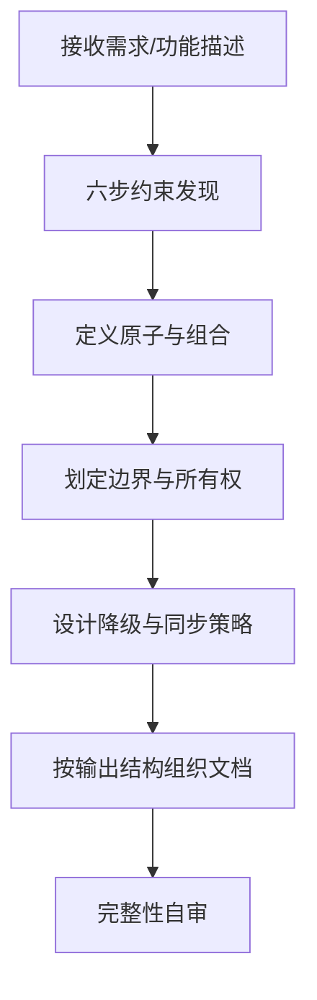
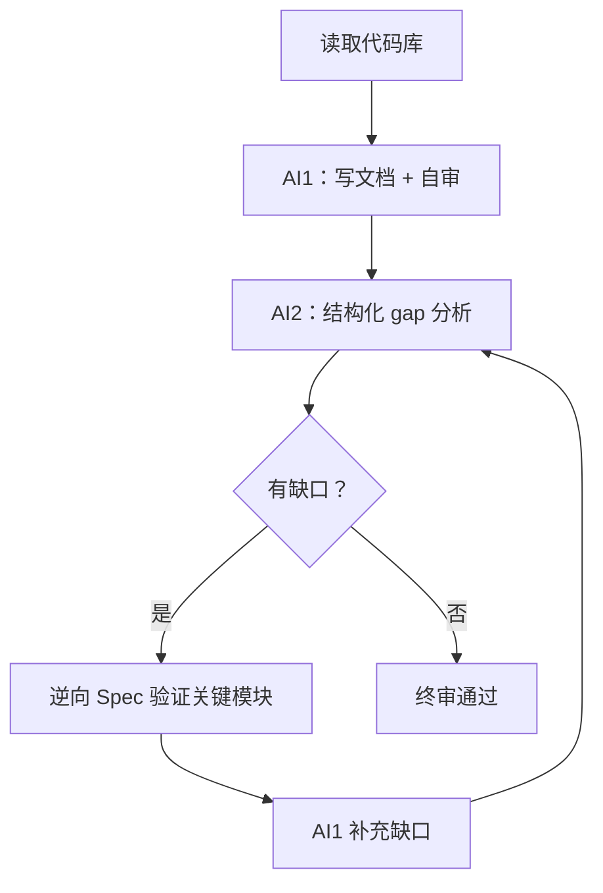
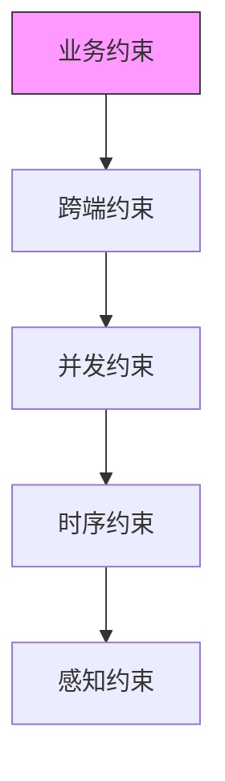
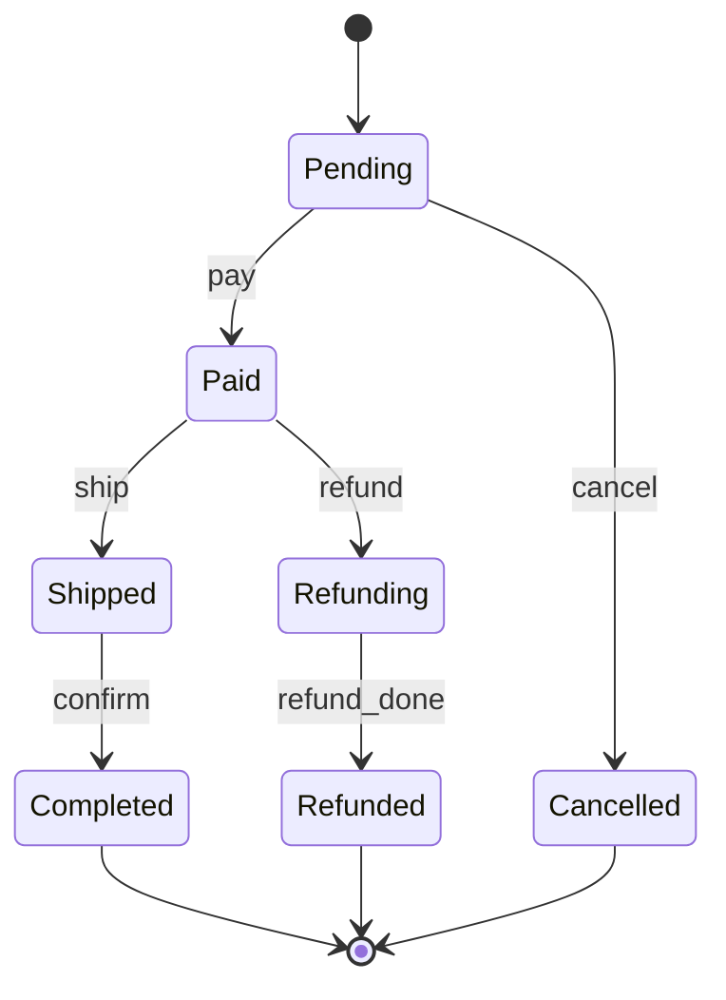
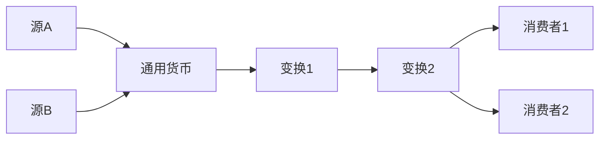

# diwu-doc

## 触发时询问

直接触发时，询问用户以下问题（上下文已明确的跳过）：

1. **模式**：正向（有需求，要写文档）还是逆向（有代码，要还原文档）？
2. **范围**：整个产品 / 特定模块 / 特定功能？
3. **输入**：代码库路径（逆向）或需求描述（正向）
4. **输出结构**：领域驱动（推荐，有 3 个以上业务域时）还是分层（工具类产品或小项目）？

---

## 工作流

### 正向模式：需求 → 文档



核心工作：用五约束维度从需求中提取约束，再用六步设计法组织成文档。

### 逆向模式：代码 → 文档



**核心原则**：代码是锚点。每条描述必须可追溯到代码或可观测行为。"写对"优先于"写全"——无法确认的内容标注 `[待确认]`，不编造。

---

## 核心框架

### 五约束维度

约束 = 不管系统怎么运行，恒成立的东西。五个维度覆盖 toC 产品复杂性的所有来源：

| 维度 | 检验问题 | 典型例子 |
|------|---------|---------|
| **业务约束** | 100 年后还成立吗？ | "已删除的记录不可恢复" |
| **时序约束** | 有没有执行路径可以绕过？ | "终态不可回退" |
| **跨端约束** | 两端不同是 bug 吗？ | "枚举值在所有端完全一致" |
| **并发约束** | 两个线程同时做会出问题吗？ | "状态机事件串行处理" |
| **感知约束** | 超过阈值用户会注意到吗？ | "操作响应 < 100ms" |



下层是上层的基础。业务约束定义错了，上面四层全是空中楼阁。

**常见遗漏**：AI 喜欢写"能做什么"，不写"不能做什么"。负面约束（"X 不可逆"、"Y 不能超过 Z"）往往是最关键的业务规则，也是最容易被遗漏的。

### 两层完整性检查

#### 第一层：结构检查（有没有？）

| 层 | 检验问题 | 检查项 |
|----|---------|-------|
| **数据层** | 能写出完整的数据库 migration 吗？ | 实体列表、字段定义（名/类型/约束）、实体关系、查询模式 |
| **接口层** | 能写出完整的 API client 吗？ | 端点列表、入参格式、出参格式、认证方式、错误码 |
| **业务逻辑层** | 不看代码就能实现核心规则吗？ | 业务规则、状态流转（状态机+转移表）、关键算法、边界条件、可视化图表 |
| **产品层** | 新人能理解"这个产品是做什么的"吗？ | 用户角色、核心用户旅程、权限矩阵、非功能需求 |

#### 第二层：深度检查（够不够？）

对第一层已覆盖的每一项，用五约束维度逐一检验：

- **业务约束**：不变的规则写了吗？特别是"不能做什么"（负面约束）
- **时序约束**：状态转移表画了吗？"先后顺序"写清了吗？
- **跨端约束**：多端相关的概念有唯一定义吗？
- **并发约束**：两个用户/线程同时操作的策略写了吗？
- **感知约束**：响应时间、加载策略有具体阈值吗？

不是 4×5=20 个格子每个都必须填满。有意识地检查过，标注"不适用"即可。

---

## 六步设计法（正向模式核心）

```
Step 1: 找约束
  ├── 100 年后还成立？              → 业务约束
  ├── 能绕过这个状态转移吗？        → 时序约束
  ├── 两端不同是 bug 吗？           → 跨端约束
  ├── 两个线程同时做会出问题吗？    → 并发约束
  └── 超标用户会注意到吗？          → 感知约束

Step 2: 定义原子
  ├── 能再拆吗？拆了还有意义吗？
  └── 一句话能说清做什么吗？说不清就不是原子。

Step 3: 设计组合
  ├── 数据有层次？                  → 结构组合
  ├── 数据依次流过变换？            → 管道组合（确定通用货币）
  └── 行为由事件驱动？              → 状态机组合（画转移表）

Step 4: 划定边界
  ├── 属于哪个业务领域？            → 领域边界
  ├── import 了平台 API 吗？        → 有则平台层，无则可统一
  └── 是事实还是投影？              → 事实不可变，投影可重算

Step 5: 设计降级路径
  ├── 列出依赖链
  ├── 每个依赖失败后用户还能用吗？
  └── 降级在代码中显式表达了吗？

Step 6: 设计同步策略
  ├── Source of Truth 在哪里？
  ├── 经过几层投影？
  └── 冲突策略是什么？（Server-wins 覆盖 90% 场景）
```

### 状态机设计（四步）

```
Step 1: 列出所有合法状态    → sealed class / enum
Step 2: 列出所有事件        → sealed class / enum
Step 3: 填转移表            → 状态 × 事件 → 新状态
Step 4: 标注非法转移        → else → 忽略（不是 bug，是设计）
```

示例（通用订单状态机）：



### 管道设计

通用货币：管道中所有步骤都认识的公共数据格式。确定通用货币后，源可替换、终点可替换。



### 变化速率原理

混合不同变化速率 = 让最快的维度决定整个单元的 IO 成本。

判断标准：两个字段放在同一数据单元里，变化频率差两个数量级以上，就应该拆开。

| 场景 | 高频 | 低频 | 正确做法 |
|------|------|------|---------|
| UI 状态 | 实时数据（每帧） | 配置信息（几乎不变） | 拆成独立 State |
| 数据库 | 处理进度（每秒） | 标题（创建后不变） | 分字段/分表 |
| 微服务 | 实时指标（毫秒） | 配置（每次发版） | 不同存储/通道 |

---

## 输出结构

### 领域驱动结构（推荐）

适合：有 3 个以上明确业务域、AI 是主要读者、长期维护的项目。

```
.doc/
├── README.md          # 文件一览 + 任务→域文件映射表
├── constraints.md     # 全局约束（跨域共享）
├── [domain-a].md      # 域A：数据/接口/业务规则/状态机
├── [domain-b].md      # 域B：同上
└── setup.md           # 环境域：技术栈、依赖、本地配置
```

最小上下文加载原则：`constraints.md` + 单个域文件 = 足够还原该域的完整功能。

域文件设计约束：
- **自包含**：该域的数据结构、接口、业务规则、状态机都在同一文件内
- **跨域引用显式化**：依赖其他域时，明确写出"见 `[domain].md §xxx`"
- **constraints.md 放全局约束**，不重复写入各域文件

### 分层结构

适合：业务域不明确的工具类产品、文档读者主要是人、小项目。

```
.doc/
├── data.md            # 数据层：实体、字段、关系
├── api.md             # 接口层：端点、入参、出参、错误码
├── logic.md           # 业务逻辑层：规则、状态机、算法
└── product.md         # 产品层：角色、旅程、权限、非功能需求
```

---

## 模板工具箱

### AI1 提示词（逆向模式：写文档 + 自审）

```
你的任务是阅读代码库，还原产品文档。

核心原则：
1. 代码是锚点。每一条描述必须可追溯到代码或可观测的行为。
2. "写对"优先于"写全"。无法从代码确认的内容，标注 [待确认]。
3. 不要编造。如果代码里没有相关逻辑，写"未在代码中发现"，不要推测。

交付要求：
按以下四层结构组织文档：
1. 数据层 — 实体、字段、关系、状态
2. 接口层 — API 端点、入参、出参、错误码
3. 业务逻辑层 — 核心规则、状态流转、算法、边界条件
4. 产品层 — 用户角色、核心旅程、权限、非功能需求

关键描述后标注代码来源（如：见 src/auth/login.ts）。
图表使用 Mermaid：状态机用 stateDiagram-v2，流程用 flowchart，关系用 erDiagram。

交付前自审：
□ 每个数据实体是否有完整字段列表？
□ 每个 API 是否有入参和出参的具体格式？
□ 每条业务规则是否有对应的异常情况处理？
□ 每个用户流程是否覆盖了"失败路径"？
□ 是否有任何地方用了"等"、"类似"、"根据情况"这类模糊表达？
□ 所有有状态的实体是否都画了 stateDiagram-v2？
□ 并发场景是否被考虑？
□ [待确认] 标记是否只在真正无法确认时使用？
□ 核心业务流程是否有 flowchart？
□ 数据实体关系是否有 erDiagram？

对每个"否"，直接补充内容后再交付。
```

### AI2 提示词（逆向模式：结构化 gap 分析）

```
你是一名即将独立接手这个项目的全栈开发者，没有任何背景知识。
你的唯一信息来源是以下文档。

请按两层检查审查这份文档。

## 第一层：结构检查

1. 数据层
   □ 核心实体列表
   □ 字段定义（名、类型、约束）
   □ 实体关系
   □ 查询模式

2. 接口层
   □ API 端点列表（路径 + 方法）
   □ 入参格式
   □ 出参格式
   □ 认证方式
   □ 错误码

3. 业务逻辑层
   □ 核心业务规则
   □ 状态流转（状态机 + 转移表）
   □ 关键算法
   □ 边界条件
   □ 可视化图表（flowchart、erDiagram）

4. 产品层
   □ 用户角色
   □ 核心用户旅程
   □ 权限矩阵
   □ 非功能需求

## 第二层：深度检查

对第一层中已覆盖的每一项，用以下五个问题检验：
- 业务约束：不随实现变化的规则写了吗？特别是"不能做什么"。
- 时序约束：状态转移表画了吗？"先后顺序"写清了吗？
- 跨端约束：多端相关的概念有唯一定义吗？
- 并发约束：两个用户/线程同时操作的策略写了吗？
- 感知约束：响应时间、加载策略有具体阈值吗？

## 输出格式

| 层 | 检查项 | 覆盖状态 | 可编码 | 具体缺失 |
|----|-------|---------|-------|---------|

深度检查补充表：

| 层 | 维度 | 覆盖状态 | 具体缺失 |
|----|------|---------|---------|

[在此粘贴文档]
```

### 逆向 Spec 技术

比"能不能开发"更精准的缺口发现方法：

```
请根据以下文档，写出 [模块名] 的前 50 行核心代码。
当你发现文档信息不足以继续时，停下来，列出你需要知道的具体问题。
不要猜测，不要用合理假设填补空白。写不下去就停。
```

写不下去的地方就是真正的缺口。

### 模块设计文档模板

```markdown
# [模块名] 设计文档

## 约束

| 维度 | 约束 | 检验 |
|-----|------|------|
| 业务 | ... | 100 年后？ |
| 时序 | ... | 能绕过？ |
| 跨端 | ... | 换端还成立？ |
| 并发 | ... | 两线程同时做？ |
| 感知 | ... | 用户能感知违反？ |

## 原子

| 类型 | 原子 | 一句话 |
|-----|------|-------|
| 实体 | | |
| 状态 | | |
| 变换 | | |
| 事件 | | |

## 状态机

[stateDiagram-v2]

## 管道

[flowchart LR]

## 边界

| 类型 | 内部 | 外部 | 跨越方式 |
|-----|------|------|---------|
| 领域 | | | 事件/API |
| 平台 | | | 接口/Adapter |
| 时间 | | | 投影函数 |

## 降级路径

| 依赖 | 失败 | 降级 | 用户感知 |
|-----|------|------|---------|

## 同步策略

| 数据 | Source of Truth | 冲突策略 |
|-----|----------------|---------|

## 所有权

[graph TD]

## 版本兼容

| 变更类型 | 安全性 | 处理方式 |
|---------|-------|---------|
| 新增 | ✅ 安全 | 直接添加 |
| 删除 | ⚠️ 危险 | 先废弃再删 |
| 改语义 | ❌ 最危险 | 版本化 |
```

### task.json 模板

```json
{
  "id": 1,
  "description": "还原 [模块名] 产品文档",
  "status": "InDraft",
  "acceptance": [
    "结构检查：数据层 / 接口层 / 业务逻辑层 / 产品层 全部覆盖",
    "深度检查：五约束维度逐项审查完成",
    "AI2 结构化审查表无'否'项（或已标注'不适用'）",
    "所有描述标注代码来源，无编造内容",
    "[待确认] 标记不超过总条目的 10%"
  ],
  "steps": [
    "AI1 读代码并按四层结构写文档",
    "AI1 用自审清单检查后交付",
    "AI2 用结构化审查提示词做 gap 分析",
    "对关键模块用逆向 Spec 技术验证",
    "合并缺口，AI1 补充",
    "AI2 终审"
  ],
  "category": "infra"
}
```

---

## 反模式速查

| 反模式 | 症状 | 根因 | 正确做法 |
|-------|------|------|---------|
| 无锚点编造 | 文档描述和代码不一致 | AI 没有先读代码 | 要求 AI 标注代码来源 |
| 模糊表达 | "根据情况处理"、"等" | 没有逼迫 AI 具体化 | 自审清单排查模糊词 |
| 只写正向 | 只有"能做什么"，没有"不能做什么" | AI 的正向偏好 | 显式要求写负面约束 |
| 只写状态不写转移 | 列了状态列表，没画转移表 | 缺时序约束审查 | 深度检查第二项 |
| 忽略并发 | 完全没考虑多用户/多设备场景 | AI 默认单用户思维 | 深度检查第四项 |
| 假完整 | 每一层都有内容，但每层都浅 | 只做了结构检查没做深度检查 | 两层检查都执行 |
| 布尔状态组合 | 多个 Boolean，存在无效组合 | 缺时序约束 | sealed class / enum |
| 上帝类 | 单个模块职责过多 | 缺领域边界 | 按原子拆分 |
| 混合变化速率 | 高频低频数据混在同一单元 | 缺速率分析 | 按速率分层 |
